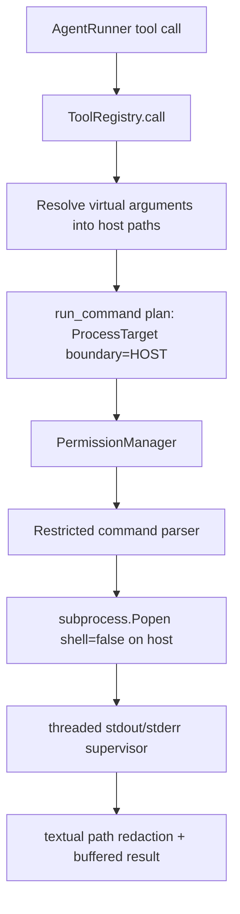

# Production command-execution architecture

**Status:** final implementation-ready architecture
**Audit date:** 2026-09-17
**Platform:** macOS Apple Silicon; other host platforms are outside this plan

This file and all other content under `docs/` are temporary rollout material. Source, tests,
builds, packaging, and releases must not read or derive runtime data from this directory.

## 1. Executive findings

The existing command subsystem has the wrong security shape: it runs a restricted argv directly on the host. There is no active sandbox backend. A now-stashed prototype attempted Linux Bubblewrap and macOS Seatbelt, but it converted virtual paths to host paths before launch, continued to reject ordinary shell syntax, predicted launch intent rather than enforcing effects, and allowed sandbox unavailability to enter a host-execution flow. That prototype is useful audit evidence only; none of its types or modules should be restored as the starting architecture.

The correct production design is one macOS isolation adapter over a platform-neutral execution
protocol:

- macOS Apple Silicon: a Loop-private Lima VZ instance using Lima’s maintained guest image and rootless containerd. The live host workspace is never an OverlayFS lower: Loop first materializes immutable Loop-owned snapshot generations. One workspace-specific Loop snapshot-store root is exposed read-only through VirtioFS to the trusted guest plane; each attempt binds one immutable generation subtree as its lower, while the private writable overlay lives on guest storage. The command container never sees the snapshot-store root.
- The sandbox provides a real POSIX shell, stable paths such as `/workspace`, immutable attempt bases, transactional workspace writes, host-filesystem-aware commit validation, runtime-enforced capabilities, an explicit result/state model, and explicit foreground versus durable-job semantics.
- macOS control plane: trusted host-initiated management travels over Lima’s VZ/AF_VSOCK-backed SSH path; management credentials, sockets, workspace host paths, and containerd control never enter the command container.
- Host execution: a separate privileged request, lease, prompt, module, supervisor, and audit trail. No sandbox result or exception can invoke it; host process cleanup is explicitly best-effort rather than claimed to equal sandbox containment.
- Product/maintenance contract: every Loop-owned implementation component is Python source inside the existing application or declarative configuration/data. Loop builds no Swift, Objective-C, C/C++, Rust, Go, kernel module, native extension, guest agent, proxy, firewall component, container runtime plugin, CNI plugin, or standalone daemon. The only executable infrastructure outside Loop is established upstream software pinned by version, immutable HTTPS source, size, and digest and installed lazily into Loop-private application data.

This is a replacement, not a repair. Useful active ideas—typed permission actions, policy ceilings, bounded output, timeouts, and virtual user-facing paths—can inform the new code, but the direct-host boundary, command parser, host-path translation, and current policy format should not survive. The stashed sandbox/fallback prototype should remain archived rather than reintroduced.

## 2. Current architecture

### Execution flow



This is the complete active flow. `src/loop/tools/system.py` parses an argv and calls `subprocess.Popen(..., shell=False)` directly. Its operation plan explicitly identifies `ProcessBoundary.HOST`. No `src/loop/sandbox` implementation is active or tracked.

### Modules and responsibilities found

| Area | Current modules | Current responsibility |
|---|---|---|
| Agent orchestration | `src/loop/agent/agent.py` | Receives tool calls and dispatches them through the registry. |
| Tool planning/dispatch | `src/loop/tooling/tool_registry.py`, `src/loop/tooling/models.py` | Resolves paths, builds plans, authorizes, creates context, and contains host confirmation. |
| Command tool | `src/loop/tools/system.py` | Plans an exact host process, parses the restricted command, calls `Popen`, supervises it, and formats the result. |
| Command parsing | `src/loop/utils/process.py` | Uses shell-like splitting but rejects metacharacters including pipes, redirects, conditionals, substitutions, and command separators. |
| Path translation | `src/loop/utils/path.py` | Resolves virtual paths into host strings, rewrites argv options, and redacts output with string replacement. |
| Permissions | `src/loop/permissions/*` | Actions, targets, policy limits, precedence, stores, approvals, and workspace identity. |
| Supervision | `src/loop/tools/system.py`, `src/loop/utils/process.py` | Creates a process group, drains bounded stdout/stderr with threads, times out, and signals the group. |
| Tests | `tests/tools/test_system.py`, permission/path tests | Validate direct host launch, authorization, cleanup, path rewriting, and ordinary shell syntax rejection. |

### Trust boundaries as implemented

The permission layer authorizes an intended host launch description. Before planning, `ToolRegistry._resolve_model_paths` converts the model’s cwd and command arguments to canonical host strings. The host child receives those strings in argv and cwd, and the model-facing layer later attempts to redact them. Thus “virtual path” is a presentation transform, not a namespace boundary.

`run_command` copies selected host variables (`PATH`, `SYSTEMROOT`, `TMPDIR`, `TEMP`, and `TMP`) and uses a canonical host cwd. Executable discovery, shebang interpretation, child processes, compiler errors, stack traces, and self-discovery all occur on the host and can expose host details.

There is no fallback decision in the active code because there is no lower-privilege path to fall back from: every successful `run_command` authorization is authorization for direct host execution. This is less ambiguous than the prototype but does not satisfy the product goal that the sandbox be normal execution.

### Stashed prototype evidence

At this audit revision, the abandoned implementation is preserved in the stash named `abandoned sandbox prototype before execution redesign`. The earlier audit established that it introduced `SandboxPlan`/`HostProcessPlan`, Bubblewrap, Seatbelt, and a `SandboxUnavailableError -> request_host_process` branch. On the audited Apple Silicon host its native check reported `Seatbelt is present but cannot enforce a child sandbox.` Its focused tests passed because they mocked platform availability and checked generated launcher arguments. These findings explain what not to restore; the implementation plan has no dependency on the stash or its mutable stash index.

### Reproduction

On the active baseline:

```text
parse_command_line("printf hi | wc -c") -> ValueError
```

The archived prototype additionally produced the Seatbelt failure described above. The current test suite encodes shell-free host execution and rejects the pipeline before `Popen`.

## 3. Defect and architecture assessment

| ID | Observed behavior | Immediate cause | Root architectural cause | Required final fix |
|---|---|---|---|---|
| D1 | Every authorized command runs directly on the host on every platform. | `run_command` calls host `subprocess.Popen`; its plan is `ProcessBoundary.HOST`. | There is no active sandbox execution architecture. | Make sandbox execution the only ordinary request; use Linux isolation and a managed macOS VM. |
| D2 | The archived prototype would have escalated sandbox unavailability into a host prompt. | Its `run_command` caught `SandboxUnavailableError` and called `request_host_process`. | Boundary selection was exception-driven fallback. | Do not restore it; use separate sandbox and host request types, and prohibit sandbox adapters from importing or returning host plans. |
| D3 | Pipes, redirects, `&&`, substitutions, grouping, and similar syntax fail. | A parser rejects shell metacharacters and launches with `shell=False`. | Security is coupled to incomplete pseudo-shell parsing. | Pass opaque script to a real shell inside the boundary. |
| D4 | Host paths can reach commands and output. | Virtual tokens are replaced with canonical host strings; mounts preserve host names; output uses `str.replace`. | No mount-level virtual namespace or small path broker exists. | Stable guest mounts and handle-relative host broker; sanitization only as defense in depth. |
| D5 | PATH, shebangs, and nested tools are fragile. | Host resolves one executable, then child PATH contains only its directory. | Runtime/toolchain identity is conflated with host discovery. | One versioned sandbox image with a deterministic guest PATH and the complete supported tool inventory. |
| D6 | A command approval describes argv/cwd/roots, not actual effects. | `ProcessTarget` aggregates a launch plan. | Permission representation models commands rather than capabilities and observed effects. | Typed effect grants plus runtime enforcement and post-run delta authorization. |
| D7 | Exact remembered approvals reprompt after small command changes; broad rules are risky. | Target identity includes full argv/cwd/policy digest. | No semantic, typed definition of “similar operation.” | Match subject/tool identity, effect, resource selector, constraints, workspace, boundary, and lifetime. |
| D8 | The archived Linux prototype could be bypassed by a mount/policy-generation mistake. | Bubblewrap argv was the main filesystem policy; it had no independent runtime attestation. | A low-level construction tool was treated as the whole product boundary. | Do not restore it; use a pinned rootless OCI stack, private workspace overlay, fixed-shape OCI policy, live attestation, and native negative tests. |
| D9 | The archived Linux syscall policy was hard to maintain and incomplete. | It used raw architecture syscall numbers in a default-allow denylist. | Product code hand-maintained kernel policy at the wrong abstraction. | Do not restore it; use the upstream-maintained default seccomp integration of the pinned nerdctl/containerd stack, record/attest the normalized effective policy digest, and regression-test required denials. Loop owns no syscall table. |
| D10 | Network policy is coarse and cannot safely express destinations. | Network availability is largely a namespace switch/metadata property. | Static launch classification cannot mediate DNS, redirects, IPs, protocols, or credentials. | No ambient external network; lease-aware egress proxy. |
| D11 | Persistent writes are not reconciled against actual effects. | Writable roots are exposed during execution. | No transaction/delta/commit layer. | Read-only base plus private overlay; inspect, authorize, then race-safe commit. |
| D12 | Interactive and long-running workflows are incomplete. | Buffered reader threads, process groups, no stdin/PTTY/job handle. | Process supervision is a helper, not a lifecycle service. | Framed streaming, PTY, backpressure, cgroup/VM ownership, attach/cancel state machine. |
| D13 | The active tests prove host execution mechanics, not isolation; the archived tests could remain green when native isolation was unavailable. | Current tests mock `Popen`; archived tests inspected generated arguments and mocked platform availability. | Live platform attestation and adversarial release gates are absent. | Mandatory native macOS integration and negative security suites on the controlled Apple Silicon release host. |
| D14 | Internal helpers can bypass the architecture. | For example, search directly launches host `rg`. | There is no classified process-creation choke point. | In-process Python, sandbox execution, or a narrow audited Python broker that invokes only fixed-shape built-in/pinned upstream commands; prohibit unclassified subprocesses. |
| D15 | A live host workspace used as an OverlayFS lower can change while mounted. | Read-only bind/VirtioFS protects against writes *through that mount* but does not freeze the source. | OverlayFS requires its underlying trees not to change while mounted; host editors, Git, sync tools, or concurrent attempts can mutate the source. | Snapshot the workspace into immutable Loop-owned storage before mounting; never use the live workspace as an OverlayFS lower. |
| D16 | macOS host↔VM control was described abstractly rather than as a concrete authenticated transport. | Broker/inspection authority crosses the VZ boundary but the transport/lifetime was unspecified. | A security boundary cannot depend on an implicit management channel. | Use pinned Lima VZ with AF_VSOCK-backed SSH for trusted host-initiated control, fixed-shape `limactl shell` and `limactl copy --backend=scp` operations, connection attestation, and no management endpoint inside the command container. No SSH/SFTP library or guest transfer service is developed by Loop. |
| D17 | Linux resource guarantees can silently weaken when user namespaces or cgroup-v2 controllers are unavailable. | Rootless OCI support depends on host kernel/systemd delegation. | CPU/memory/pids/I/O guarantees were stated more broadly than the zero-remediation host contract permits. | Require delegated cgroup-v2 memory and pids controls on every supported host; enforce CPU with cgroup CPU when already delegated and otherwise with per-process-tree CPU-time budgets plus wall deadlines; enforce storage/I/O consumption with filesystem quotas and byte budgets rather than requiring the commonly undelegated I/O controller. Publish only clean OS images that pass this exact contract. |
| D18 | Linux guest semantics can represent filenames/metadata that the host workspace cannot commit. | Linux is normally case-sensitive while macOS APFS is commonly case-insensitive and normalization-insensitive. | Runtime namespace semantics and destination-filesystem semantics differ. | Capture destination filesystem capabilities and reject unrepresentable deltas before approval/commit. |
| D19 | The selected `command-core` image cannot perform ordinary repository work such as `git status`. | The manifest points at an upstream pre-converted Alpine benchmark image instead of building the checked-in complete sandbox environment during first use. | Runtime-image construction was split into external publication, profiles, CI promotion, and evidence machinery instead of being part of the normal `run_command` setup path. | Build, readiness-check, cache, and product-test one complete OCI image locally from one checked-in Containerfile during managed sandbox installation. |
| D20 | A runtime default seccomp profile can change when dependencies change. | Policy identity was only indirectly tied to runtime versions. | Attestation of “seccomp enabled” is weaker than attestation of the effective policy. | Keep the upstream-maintained default profile from the pinned nerdctl/containerd stack; release preparation records the normalized effective OCI seccomp identity associated with every included upstream artifact variant, and live startup attestation on the selected host must match it. This variant data does not create a separate native qualification track. Loop does not fork or hand-maintain a syscall profile. |

The active root problem is more fundamental than “too many fallbacks”: there is only host execution. The stashed prototype would have added an unsafe fallback while keeping command semantics, path presentation, authorization, backend selection, process creation, and privilege escalation entangled. Adding exception cases, restoring that prototype, or expanding the parser would make the boundary less reviewable.

## 4. State-of-the-art research

### Linux

- Linux [mount namespaces](https://man7.org/linux/man-pages/man7/mount_namespaces.7.html) (manual page updated in the current man-pages project) isolate mount views; [user namespaces](https://man7.org/linux/man-pages/man7/user_namespaces.7.html) map IDs and capabilities. `chroot` alone is not an isolation boundary; a private mount namespace with a controlled root is required.
- Bubblewrap’s [official README](https://github.com/containers/bubblewrap) describes it as a low-level namespace/mount construction tool whose policy is entirely determined by arguments. It supports PID/network namespaces and seccomp, but is not a complete policy engine. [Release 0.12.0](https://github.com/containers/bubblewrap/releases) documents an `openat2(...RESOLVE_IN_ROOT...)` symlink-security change, evidence that it must be pinned, updated, and layered.
- The Linux kernel documentation states that [seccomp filtering is not a sandbox](https://docs.kernel.org/userspace-api/seccomp_filter.html); it reduces syscall surface and must be composed with other controls. BPF cannot safely interpret pointed-to path strings, and architecture checks are essential.
- Current [Landlock documentation](https://docs.kernel.org/userspace-api/landlock.html) specifies unprivileged, inherited filesystem rules and, in newer ABIs, network bind/connect and abstract Unix-socket scope. ABI negotiation is mandatory because older kernels lack newer rights such as truncate mediation.
- [cgroup v2 documentation](https://cdn.kernel.org/doc/html/latest/admin-guide/cgroup-v2.html) defines CPU, memory, pids, and I/O controllers and reliable process membership. Rlimits alone cannot contain a process tree.
- [OCI’s Linux runtime specification](https://github.com/opencontainers/runtime-spec/blob/main/config-linux.md) is useful evidence for composing namespaces, cgroups, capabilities, LSMs, mounts, and seccomp. Docker is not required; its daemon/socket would add unnecessary authority.
- [nsjail](https://github.com/google/nsjail) and [gVisor](https://gvisor.dev/docs/architecture_guide/security/) were evaluated. Both add a separate policy/runtime dependency; gVisor also adds a compatibility/performance tax. Neither is part of the selected production dependency set or definition of done.
- The official [nerdctl project](https://github.com/containerd/nerdctl) publishes architecture-specific `nerdctl-full` archives containing containerd, runc, CNI plugins, RootlessKit, and related dependencies. These can be installed under an application-private prefix and driven rootlessly, avoiding a user-managed Docker/Podman installation.
- Nerdctl's maintained [command reference](https://github.com/containerd/nerdctl/blob/main/docs/command-reference.md) defines `create`, attached `start`, `attach`, `wait`, signals, inspection, and removal as separate CLI operations; attached I/O is a byte stream rather than a lifecycle JSON protocol, and the documented single-attach/detached-container caveats require exact candidate conformance tests. Containerd explicitly classifies [`ctr` as an unstable debugging client](https://github.com/containerd/containerd/blob/main/RELEASES.md#ctr-tool), so it is not a production fallback for missing nerdctl behavior.
- The current Linux [OverlayFS documentation](https://docs.kernel.org/filesystems/overlayfs.html#changes-to-underlying-filesystems) states that changing an underlying filesystem while it participates in a mounted overlay is not allowed and makes behavior undefined. Therefore a read-only view of a *live* workspace is not a valid lower layer; the lower must be an immutable Loop-owned materialization.
- Linux [`FICLONE`](https://man7.org/linux/man-pages/man2/FICLONE.2const.html) provides atomic copy-on-write file clones on supporting filesystems. Loop uses it as an optimization when source and snapshot storage permit it, with a verified userspace copy fallback that preserves correctness on every supported filesystem.
- Current nerdctl/containerd rootless documentation requires cgroup v2 and systemd for rootless resource-limit flags. RootlessKit also requires a usable subordinate-ID source (`newuidmap`/`newgidmap` plus subuid/subgid allocation in the selected mode), and Ubuntu 24.04+ can block an application-private RootlessKit binary through its default AppArmor user-namespace policy. Rootless cgroup guidance also documents that memory and pids are normally delegated while CPU/cpuset/I/O delegation commonly needs administrator configuration. These are host support facts that Loop cannot safely repair without administrator changes. The final Linux contract therefore makes delegated memory and pids mandatory, uses cgroup CPU only when already available, supplies an invariant CPU-time/deadline fallback, and enforces storage consumption with quotas/byte budgets rather than requiring cgroup I/O. It qualifies named release OS images up front and fails unsupported hosts before runtime installation; it never turns prerequisites into user setup.
- Nerdctl's official [command reference](https://github.com/containerd/nerdctl/blob/main/docs/command-reference.md) supports `--network ns:<path>` for joining an existing network namespace, and RootlessKit [documents](https://github.com/rootless-containers/rootlesskit#state-directory) the stable `netns` handle created by detached-netns mode in its private state directory. The trusted runtime supervisor can therefore place Envoy explicitly in the attested RootlessKit child namespace instead of relying on the ambiguous meaning of `--net=host`. This uses the already-pinned upstream stack and adds no helper, daemon, firewall dependency, or mixed host/CNI attachment.
- Python's standard [`shutil`](https://docs.python.org/3/library/shutil.html#platform-dependent-efficient-copy-operations) uses platform fast-copy syscalls (`fcopyfile` on macOS and `copy_file_range`/`sendfile` on Linux) before falling back to userspace copying. This gives the non-reflink snapshot path kernel-assisted performance without another copy utility or library.

### macOS Apple Silicon

- Apple’s `sandbox_init` manual, dated March 9, 2017 in the current SDK manpage mirror, marks the interface and named profiles deprecated: [sandbox_init(3)](https://keith.github.io/xcode-man-pages/sandbox_init.3.html). The older [sandbox(7)](https://keith.github.io/xcode-man-pages/sandbox.7.html), dated January 29, 2010, also notes that already-open descriptors remain usable. Seatbelt profile language is not an appropriate new production contract.
- App Sandbox is for signed application containers and entitlements, not arbitrary per-command repository policy or normal developer toolchains.
- Apple officially supports arm64 Linux guests with [Virtualization.framework](https://developer.apple.com/documentation/virtualization/running-linux-in-a-virtual-machine). It provides [shared directories](https://developer.apple.com/documentation/virtualization/shared-directories), explicit read-only [`VZSharedDirectory`](https://developer.apple.com/documentation/virtualization/vzshareddirectory), guest/host [`VZVirtioSocketDeviceConfiguration`](https://developer.apple.com/documentation/virtualization/vzvirtiosocketdeviceconfiguration), and optional [NAT](https://developer.apple.com/documentation/virtualization/vznatnetworkdeviceattachment). NAT is too broad for fine-grained grants, but the VM boundary and Virtio transports are suitable.
- [Endpoint Security](https://developer.apple.com/documentation/endpointsecurity) can observe/authorize selected host events but requires special entitlements/system-extension deployment. It was evaluated and rejected for this architecture because it would add deployment/entitlement complexity without replacing the VM boundary.
- [Lima](https://lima-vm.io/docs/config/vmtype/vz/) is an established VM manager whose VZ backend uses Virtualization.framework and is the default on modern macOS. Its [binary archives can be extracted to an arbitrary directory](https://lima-vm.io/docs/installation/), its Tier-1 default image integrates rootless [containerd and nerdctl](https://lima-vm.io/docs/examples/containers/containerd/), and its mount configuration supports read-only VirtioFS. Using the upstream binary moves VM, guest-agent, kernel/image boot, and entitlement integration out of Loop.
- Current Lima supports [SSH over AF_VSOCK](https://lima-vm.io/docs/config/port/) for VZ guests when the guest systemd version is sufficient. The final design uses that path only for Loop’s trusted host-initiated management traffic and does not depend on generic Lima `guestSocket` forwarding for security-critical broker traffic.
- Apple requires the [`com.apple.security.virtualization`](https://developer.apple.com/documentation/bundleresources/entitlements/com.apple.security.virtualization) entitlement for Virtualization.framework. Lima's official Darwin build applies an ad-hoc signature with that entitlement to `limactl`; ad-hoc signing seals the executable and its entitlements but does not authenticate a publisher. Loop verifies the release-pinned archive's immutable HTTPS origin, size, and SHA-256 before installation, then uses `codesign --verify --strict` and entitlement extraction to prove that the installed executable is intact and carries the exact VZ capability set. A Team ID, Developer ID, App Store signature, Loop signing identity, Xcode installation, Apple Developer account, upstream provenance statement, or upstream SBOM is not part of this contract.
- macOS provides [`clonefile`/`fclonefileat`](https://keith.github.io/xcode-man-pages/clonefile.2.html) copy-on-write cloning on supporting filesystems. Loop uses file-level clones when possible and a verified byte-copy fallback otherwise; it does not require APFS snapshots or administrator privileges.
- APFS is commonly case-insensitive and normalization-insensitive while Linux guest filesystems are generally case-sensitive. The final commit path therefore models destination filesystem representability explicitly rather than assuming every valid Linux delta can be committed to macOS.
- Lima's current [`limactl copy`](https://lima-vm.io/docs/reference/limactl_copy/) provides host↔guest copy with `scp` as the reliable always-available backend and `rsync` only as an optional acceleration. The final design pins the `scp` backend so Loop does not add an rsync or SSH/SFTP-library dependency.

### Portable approaches

- WASI offers a capability-oriented direction, but the current [proposal maturity table](https://github.com/WebAssembly/WASI/blob/main/docs/Proposals.md) and [wasi-sdk limitations](https://github.com/webassembly/wasi-sdk) show gaps in networking, threads, dynamic linking, and native binary compatibility. It cannot provide arbitrary real-world POSIX developer tooling.
- Rootless OCI containers are strong Linux packaging/isolation machinery. On macOS they still need a VM; a Loop-private Lima VM plus rootless containerd provides that layer without requiring users to install a container product or Loop developers to maintain a hypervisor helper.
- Firecracker-style microVMs are strong on Linux/KVM but impose KVM availability, image, memory, and startup costs. They were evaluated and are not part of the selected production dependency set.

### Established broker tooling

- Envoy's maintained HTTP routing, [TCP proxy](https://www.envoyproxy.io/docs/envoy/latest/configuration/listeners/network_filters/tcp_proxy_filter), TLS Inspector, [UDP proxy](https://www.envoyproxy.io/docs/envoy/latest/configuration/listeners/udp_filters/udp_proxy), RBAC, connection limits, and TLS policy cover the selected broker surface without a Loop proxy implementation. The final design deliberately uses **static per-lease upstream clusters/listeners generated from already-authorized, pre-resolved endpoints**; it does not use Envoy's dynamic-forward-proxy feature, so destination-IP safety does not depend on an extra host firewall. Hostname-scoped TLS is transparently directed to a gateway listener by an attempt-specific read-only hosts mapping and is accepted only when the observed ClientHello SNI matches an authorized hostname; encrypted/absent/unparseable SNI is unsupported for such a lease rather than being treated as an IP-only grant.
- Envoy publishes an official arm64 `distroless` image. The release pins that variant by digest so the network capability adds one small established sidecar image rather than another OS/tooling surface.

### Existing developer tools

- VS Code’s [Workspace Trust](https://code.visualstudio.com/docs/editing/workspaces/workspace-trust) demonstrates durable workspace trust and the need to disable execution features for untrusted content, but it is a coarse UX layer rather than per-effect enforcement.
- Bazel’s [sandboxing documentation](https://bazel.build/versions/6.0.0/docs/sandboxing) favors explicit failure when the selected strict strategy is unavailable instead of silently changing isolation semantics.
- The current OpenAI Codex [app-server protocol](https://github.com/openai/codex/blob/main/codex-rs/app-server/README.md) is useful evidence for structured approval lifecycle and session policy amendments. Its design is evidence, not a template; this repository still needs runtime effect enforcement and its own threat model.

Research conclusion: no single primitive meets the requirements, but Loop does not need to implement a hypervisor, container runtime, kernel, network stack, proxy, CNI plugin, VM distribution, guest agent, or native launcher. It automatically provisions pinned upstream Lima and nerdctl/containerd distributions inside application data and lazily pulls one established Envoy image only when a network capability is first used. Loop-owned execution logic remains Python plus declarative OCI/CNI/Envoy/Lima configuration. The stable product abstraction sits above those dependencies. Two invariants make the design correct: (1) every command runs against an immutable Loop-owned workspace snapshot, never a live host tree used as an OverlayFS lower, and (2) every persistent result is validated against the destination host filesystem and committed through the same handle-relative broker semantics. macOS control traffic uses Lima's own VZ/AF_VSOCK-backed management path through fixed-shape `limactl` operations.

## 5. Requirements derived from the research

### Product priority and simplicity guardrails

Usefulness comes first within the non-negotiable sandbox boundary. A supported user installs Loop,
calls `run_command`, and receives a useful result; first use automatically installs the pinned Lima
and rootless runtime, builds a pinned base image plus one immutable host-toolchain realization,
verifies both, and executes the original command. There is no separate setup workflow.

The checked-in Containerfile supplies only the stable Linux execution substrate. A trusted host
probe records the active portable developer tools by canonical executable identity, semantic
version, distribution flavor, and required capabilities. The guest builder realizes Linux-native
equivalents with the same versions into a content-addressed tool layer. Tools absent on the host
are absent from the command PATH. A host-only tool produces a typed parity-unavailable result; its
macOS binary is never copied or mounted. Exact cached realizations work offline, while an uncached
realization never substitutes another version.

Every downloaded runtime, guest, base-image, and package input uses fixed HTTPS origins, bounded
redirects and sizes, pinned SHA-256 or OCI digests, signed package-repository metadata, safe
extraction, private temporary state, and atomic activation. Provenance statements, SBOMs,
SLSA/in-toto material, artifact signatures, published images, and external CI evidence are optional
review inputs only; their absence never blocks development, installation, qualification, or
release. Security is proved locally through live isolation and containment attestation, cleanup,
failure injection, and real public `run_command` tests.

Ordinary commands never fall back to host execution. Host execution remains a separately
constructed, warned, authorized, and audited capability.

### Functional

- F1: execute an opaque script in a real declared shell; support PATH, shebangs, builtins, assignments/expansion, quoting, escaping, globbing, pipelines, all redirection forms, `&&`, `||`, `;`, subshells, groups, substitution, heredocs, relative paths, `cd`, nested shells, signals, and exit propagation.
- F2: provide pipe and PTY modes, stdin, ordered streaming stdout/stderr, backpressure, timeout, cancellation, background/job behavior, durable long-running handles, and complete process-tree cleanup.
- F3: run common VCS, search, compiler, interpreter, package-manager, test, build, lint, format, and generator workflows in the sandbox runtime.
- F4: make read-only coding operations frictionless while preserving explicit approval for persistent mutation and other privileged effects.

### Security

- S1: sandbox is the only ordinary boundary; initialization/infrastructure/command failures fail closed.
- S2: host execution requires an explicitly typed request and applicable grant; it is structurally unreachable from sandbox errors.
- S3: child processes and nested shells inherit the boundary.
- S4: prediction never authorizes; mounts/kernel controls/brokers/delta commit enforce actual capabilities.
- S5: default-readable data is limited to workspace, selected public runtime/tool layers, and explicitly configured dependencies. Host home, SSH/cloud/browser data, history, keychains, environment secrets, agent/container sockets, and user services are absent unless individually granted.
- S6: persistent writes are transactional candidate deltas; ephemeral `/tmp`, `/home/agent`, and managed `/cache` are distinct and discarded or lifecycle-controlled.
- S7: no ambient outbound/listening network, host IPC, devices, credentials, system configuration, package installation, privilege escalation, process signaling outside the tree, or writes outside the workspace.
- S8: the attempt base is immutable for the entire mounted lifetime. A live host workspace is never an OverlayFS lower; snapshot creation and immutable-base verification are release-gated security invariants.
- S9: management/control channels are absent from the command container. On macOS the host initiates all privileged VM control over the attested VZ/AF_VSOCK-backed SSH channel; on Linux only Loop’s trusted supervisor can reach the private containerd/RootlessKit control sockets.
- S10: a delta is never promptable or committable unless every path/name/type/metadata operation is representable on the destination host filesystem.

### Path and UX

- P1: the model sees stable `/workspace`, `/home/agent`, `/tmp`, `/cache`, `/tools`, and approved `/skills/<id>` paths only.
- P2: absolute/relative paths, `.`, `..`, normalization, symlinks/broken symlinks, `realpath`, `readlink`, file URLs, PATH lookup, cwd/home/temp inheritance, diagnostics, stack traces, `/proc`, and executable self-discovery preserve virtual names or are sanitized.
- P3: model, sandbox, host, and optional user-display path representations are distinct; only a small privileged broker maps host resources.
- P4: prompts explain operation, reason, resource, boundary, scope, lifetime, and future coverage. Similar safe operations reuse semantic grants without exact-command matching or broad bypasses.

### Operational

- O1: one platform-neutral backend contract with one macOS implementation. Host-platform mechanics do not enter common product semantics.
- O2: typed results distinguish program failure, missing executable, capability denial, unsupported capability, initialization/infrastructure failure, limit, timeout, and cancellation.
- O3: resource controls cover CPU, memory, pids, file descriptors, disk/temp/cache, output, duration, and fork bombs.
- O4: native security tests—not mocked construction tests—are release gates.
- O5: upstream runtime bundles, the base OCI image, repository snapshot, package inputs, and each host-parity tool realization are pinned by digest or exact immutable identity. The composed local image is identified by its resulting descriptor and toolchain-manifest digest, installed atomically under Loop-owned application data, observable, patchable, and roll-backable.
- O6: installing Loop is the only user setup. First use may download the pinned runtime with visible progress, but must not require Homebrew, Docker, Podman, Xcode, an Apple Developer account, administrator access, or a system-wide daemon.
- O7: supported macOS means Apple Silicon, macOS 13+ (or the higher minimum required by the pinned Lima/guest combination), VZ support, valid Lima virtualization entitlement/signature, sufficient disk capacity for immutable snapshots, and a guest image that passes the pinned AF_VSOCK-SSH/rootless-containerd/cgroup requirements.
- O8: no new runtime Python package is required by this redesign. Loop reuses its existing Python dependencies where already present and otherwise uses the Python standard library (`asyncio`, `subprocess`, `os`, `fcntl`, `ctypes`, `shutil`, `hashlib`, `tarfile`, `sqlite3`, etc.) and fixed-shape invocations of pinned/built-in tools. There is no separately compiled Loop native extension.
- O9: the complete external runtime set is finite: macOS Lima plus its pinned guest image and `nerdctl-full`; the pinned base-image inputs; checksum-locked Linux-native tool archives selected by the host-toolchain manifest; and one upstream **Envoy distroless** OCI image for approved networking. A pinned, builder-only multi-tool realizer may be used only for backends whose lock records contain per-platform immutable URLs and checksums. Ecosystem-native locks remain authoritative for Python, Node, Go, and Rust project dependencies.
- O10: provisioning is one idempotent path. On `run_command`, Loop probes the host toolchain, fingerprints it, prepares Lima/rootless containerd, builds or reuses the base, and builds or reuses the matching immutable Linux-native tool layer. Readiness verifies exact presence, absence, versions, flavor/capabilities, PATH, and manifest digest. Host tool changes select a new realization. Warm execution performs no downloads, builds, package installation, or global setup.
- O11: performance is a release requirement, not a later optimization. Warm execution reuses the workspace VM and private rootless runtime; OCI content remains in the private content store; workspace synchronization occurs at agent-context creation/explicit refresh rather than per command; warm commands perform no recursive host scan; agent branch advancement and post-processing scale with the command delta; offline commands do not create a proxy sidecar.

## 6. Architectural options

| Option | Boundary / fidelity | Performance / install | Platforms / paths | Enforcement / reporting | Maintainability / verdict |
|---|---|---|---|---|---|
| Patch Seatbelt + Bubblewrap | Weak/inconsistent on macOS; real shell could be added | Low latency, host tools | All claimed, but host-shaped paths | Construction errors are dangerous; weak write reconciliation | Deprecated macOS basis; reject. |
| User-installed Docker/Podman | Good shell/tool compatibility | Warm containers fast; substantial prerequisite and ownership ambiguity | All targets, but default host mounts/configuration vary | Mature OCI controls | Reject: violates seamless installation and shares a high-authority user runtime. |
| Self-managed Virtualization.framework VM | Strong macOS boundary and exact control | Requires Swift helper, signing/entitlement packaging, kernel/initramfs/image lifecycle | macOS only; excellent paths | Strong | Reject: excessive product-specific native maintenance. |
| WASI/WebAssembly | Strong capability concept, low native fidelity | Fast for compiled modules | Portable but cannot run arbitrary native tools | Fine for purpose-built plugins | Reject for general command execution. |
| VM on every platform | Strongest consistent kernel boundary | Higher memory/startup/fs cost; Linux needs KVM | Good stable paths; all arch images possible | Excellent isolation/attestation | Reject: violates the performance/seamless-Linux target and adds VM-image lifecycle. |
| Linux gVisor + macOS VM | Stronger Linux syscall mediation | Compatibility/performance tax and another runtime | Linux + macOS; stable paths | Strong reporting possible | Reject for this production architecture: extra dependency/maintenance. |
| **Loop-managed upstream Lima + nerdctl/containerd** | macOS VM plus rootless OCI; Linux rootless OCI; full shell | One-time automatic download; warm thereafter; no user prerequisite | All required targets; same OCI image and guest paths | OCI controls plus VM on macOS, private overlay and brokers | **Selected: best security/usability/maintenance balance.** |

Host-installed tools are deliberately not mounted or copied because Darwin executables are not a
Linux toolchain. The selected design realizes the same active portable tool set and versions as
Linux-native, immutable, checksum-locked content. Base operating-system utilities are declared
infrastructure rather than mirrored developer tools. Genuine macOS-only tools require explicit
host execution or fail with `ToolchainParityUnavailable`.

## 7. Selected target architecture

```mermaid
flowchart LR
    A[Agent/User] --> B[ExecutionService]
    B --> C[RequestNormalizer]
    C --> D[CapabilityPlanner]
    D --> E[PolicyEvaluator + PermissionStore]
    E --> F[AttemptCoordinator]
    F --> W[WorkspaceSnapshotter]
    W --> G{SandboxAdapter}
    G -->|Linux| H[Loop-private rootless containerd]
    G -->|macOS| I[Loop-private Lima VZ VM]
    I --> V[VZ/AF_VSOCK trusted management plane]
    V --> J[rootless containerd in VM]
    H --> K[OCI container]
    J --> K
    K --> X[Pinned multi-arch runtime image]
    X --> Y[Real shell + process tree]
    Y --> L[Immutable snapshot + private workspace overlay]
    Y --> M[Lease-scoped network/secret services]
    L --> N[DeltaInspector + representability validator]
    N --> O[Commit authorization]
    O --> P[Path/Commit broker]
    B --> Q[Explicit HostExecutionRequest]
    Q --> R[Host permission lease]
    R --> S[Separate HostSupervisor]
    B --> T[Sanitized events]
```



Authoritative responsibilities:

- `RequestNormalizer`: validates shell/runtime, opaque script size/encoding, virtual cwd, environment declarations, terminal mode, limits, and requested capabilities. It never parses shell syntax for safety.
- `CapabilityPlanner`: combines explicit request, versioned command knowledge, and workspace policy to propose grants and explanations. Advisory only.
- `PolicyEvaluator`: sole authority for minting a lease from administrative ceilings, denies, stored grants, and user decisions.
- `AttemptCoordinator`: sole lifecycle owner. It selects exactly one sandbox adapter from the authorized request and cannot launch host processes. Every attempt is bound to one `AgentWorkspaceContext`; the coordinator leases that agent's current generation, creates a fresh attempt-private overlay, owns foreground/durable-job state, and orders teardown before any agent branch advancement.
- `AgentWorkspaceManager`: owns independent **logical** workspace state per `agent_run_id` (or equivalent agent execution identity), never per application process. Each context references one immutable shared base snapshot, one opaque private branch reference, a monotonically increasing `generation_id`, and a canonical journal of that agent's successfully committed deltas. It does not mount OverlayFS or import a sandbox adapter. Physical branch creation, fork, delta application, and disposal are delegated through `WorkspaceMaterializer`, whose native implementation is supplied by each platform adapter. Different agents may share immutable base storage but never a writable branch/work directory. A parent spawning a child agent forks the logical view by replaying only the parent's committed delta journal through that materializer; no mutable branch is shared.
- `WorkspaceMaterializer`: a narrow platform protocol owned by `execution.vfs` and implemented by each platform adapter. It creates an opaque branch from an immutable base, exposes a read-only generation reference for an attempt, applies one canonical delta idempotently under a transaction ID, forks a branch by replay, and disposes it. Unit tests use an in-memory/directory test double only; no fake materializer is shipped or selected in production.
- `WorkspaceSnapshotter`: a Python module inside Loop, not a helper executable or daemon. It opens the host workspace by authenticated root handle and materializes/reuses a Loop-owned immutable **base snapshot only when an agent context is created or explicitly refreshed**, not before every command. It records a content/identity manifest and destination-filesystem capability record and never exposes a writable alias back to the source. It uses Linux reflink through `fcntl.ioctl` and macOS clone APIs through a narrow `ctypes` standard-library binding when available, with `shutil`/descriptor-based kernel fast-copy fallback. Concurrent agent starts may coalesce one identical base-snapshot construction; the resulting immutable base may be leased by many agents.
- `RuntimeBootstrapper`: consumes the runtime manifest and single image specification, downloads and verifies the platform runtime and build inputs, coordinates the private local image build, performs the bounded readiness check, records readiness, installs atomically under Loop application data, leases the active version, and performs rollback/garbage collection. It never installs globally or requests administrator access; the platform runtime adapter owns containerd/Lima/transient-builder lifecycle.
- `SandboxAdapter`: translates the authorized attempt into fixed-shape `limactl`/`nerdctl` argv, attests the resulting VM/container, and returns a process handle. Model text never controls runtime flags.
- Lima’s VZ VM, rootless containerd/runc, the OCI configuration, and brokers are authoritative for runtime filesystem, process, network, secret, IPC, and device access. On macOS, Loop invokes only Lima's established CLI: fixed-shape `limactl shell` for trusted guest operations and `limactl copy --backend=scp` for fixed lease-scoped file transfer. Lima owns SSH/AF_VSOCK details. Loop implements no SSH/SFTP protocol code and requires no rsync. The command container has no SSH keys, management socket, Lima guest-agent endpoint, or containerd socket.
- `DeltaInspector`/`FilesystemRepresentabilityValidator`/`CommitBroker`: authoritative for persistent host-visible filesystem effects. The validator compares the canonical Linux delta with the destination filesystem’s case/Unicode equivalence, path/name limits, file type, executable/basic mode semantics, and the portable metadata-preservation policy before permission UI or commit. Nonportable topology/metadata mutations are rejected rather than emulated.
- `HostExecutionBroker`: sole host launch authority, reachable only from a distinct authorized host request.
- `EventSanitizer`: transforms privileged evidence into model/user views; it is not the primary path boundary.

The runtime distribution is deliberately simple and data-driven. The manifest identifies the native Lima and `nerdctl-full` archives, Lima guest image, base OCI image, package source, and Envoy image. One checked-in Containerfile and one package/command inventory define the sandbox image. A small local readiness record contains only the source version and resulting local image identifier needed to decide whether rebuilding is required. There is no profile catalog, image-selection policy, Loop image URL, published Loop image digest, SBOM/provenance requirement for the locally built image, or remotely mutable manifest.

## 8. Execution lifecycle

### Agent workspace context and read-only sandboxed command

An application may run many agents concurrently. Workspace state is therefore bound to an `AgentWorkspaceContext`, keyed by `agent_run_id` plus workspace identity, never to the application process. Creating a new agent context performs the only normal full workspace synchronization for that agent: `WorkspaceSnapshotter` captures or reuses an immutable shared base snapshot. Concurrent starts may coalesce the same snapshot build. Once created, the agent keeps a private branch and generation counter until the task ends or an explicit refresh is requested. Commands do **not** rescan or recopy the host workspace.

1. Normalize an opaque shell request with virtual cwd and resolve its `AgentWorkspaceContext`.
2. Planner requests workspace/runtime reads, process-tree creation, and private temp/cache as needed.
3. Policy evaluator matches defaults/grants; ordinary workspace/runtime reads require no prompt.
4. Coordinator takes a lease on the agent's current `generation_id`. The current agent view is a trusted read-only OverlayFS view of `immutable shared base + private cumulative agent branch`. The branch is not modified while any attempt uses that generation.
5. Coordinator attests the platform backend and creates a fresh attempt-private upper/work layer over that read-only agent view. Linux OverlayFS explicitly supports another overlay filesystem as a lower filesystem; the same two-level shape is used inside the macOS Linux guest.
6. The OCI container runs the real shell. Runtime controls prevent ungranted external effects.
7. A read-only command has an empty attempt upper; teardown releases only the attempt layer/generation lease. There is no host-tree scan, snapshot rebuild, content hashing, or branch mutation on the warm read-only path.

### Persistent write requiring approval

1. Known metadata may predict the write and request a pre-run grant. If not predictable, the shell runs with its attempt-private writable overlay because workspace changes are reversible.
2. Network/secrets and other irreversible capabilities are still denied unless pre-granted.
3. After complete process-tree termination, freeze and classify **only the attempt upper layer** into a canonical delta using virtual paths; unchanged workspace content is never traversed for post-processing.
4. Validate the entire delta against `DestinationFilesystemCapabilities`; case/Unicode aliases, unsupported object types, path/name-limit violations, nonportable hardlink-topology changes, ACL/security-xattr/ownership changes, or any effect whose existing metadata cannot be preserved losslessly return `UnrepresentableDelta` before any approval prompt.
5. Policy evaluator matches each representable create/replace/delete/rename/metadata effect. Unmatched promptable effects produce a permission request explaining scope and proposed reuse.
6. On approval, the coordinator takes the workspace commit lock, revalidates only the affected paths against the agent generation's base identities, and creates one durable transaction record containing the transaction ID, workspace/agent/base/generation identities, complete canonical delta, staged-content identities, and expected host preconditions. It fsyncs that record and its directory in `PREPARED` state **before the first host mutation**. Conflict detection is effect-aware: unrelated sibling changes by another agent do not conflict, while replace/delete/rename/path-creation collisions do. No lock is held while either agent executes.
7. The host commit broker applies the transaction idempotently through the authenticated workspace root. After every host operation is durable, it writes and fsyncs `HOST_APPLIED` and releases the workspace commit lock. Recovery from `PREPARED` reacquires that lock and completes the approved deterministic host plan from transaction-owned staged material; it never guesses from the current tree or attempts an ambiguous rollback after publication has begun. POSIX multi-file publication is recoverable rather than globally atomic, and no later host commit can interleave with a nonterminal host phase.
8. `AgentWorkspaceManager` then advances **only that agent** under its per-agent branch lock by calling `WorkspaceMaterializer.apply_delta(branch_id, transaction_id, delta)`. The manager does not know whether the materializer uses OverlayFS, a guest mount, or another attested native mechanism. The platform materializer applies the canonical delta idempotently through its trusted writable maintenance view and returns only after the physical branch is durable. The manager increments `generation_id` and marks+fsyncs `BRANCH_APPLIED`, then `COMMITTED`. This is `O(delta)` and does not copy or scan the workspace. Only after `COMMITTED` may staged recovery material be reclaimed. On denial, no transaction record is created, the sandbox adapter discards its attempt layer, and the agent generation does not change.
9. Recovery is driven by this write-ahead transaction journal: `PREPARED` resolves the host phase, `HOST_APPLIED` replays the delta into a fresh or existing private branch, `BRANCH_APPLIED` finalizes the generation/commit marker, and `COMMITTED` is already complete. Every transition is idempotent and compares the recorded object/content identities before acting. Recovery never imports another agent's private view, and crash tests cover every fsync and state-transition boundary.

### Previously approved write

The semantic grant matches subject identity, effect type, virtual path selector, workspace identity, constraints, boundary, policy version, and lifetime. The delta is committed without another prompt only if every effect matches. A changed executable/profile, workspace, path, operation, limit, or expired/revoked lease prompts or denies.

### Foreground and durable-job execution

Foreground shell syntax and Loop job lifetime are deliberately separate. `cmd &` inside an ordinary foreground attempt does not create a durable Loop job: the attempt completes only when its supervised container task reaches the terminal state, and cancellation/normal completion kills any remaining descendants before delta inspection. A shell cannot daemonize out of the container/cgroup and keep the attempt alive implicitly.

A durable job is requested explicitly with `ExecutionMode.DURABLE_JOB`. It receives a task/workspace/runtime lease-bound container identity and a durable `JobHandle`. Its container remains the lifecycle boundary across shell exit; attach, stdin, resize, signal, suspend/resume where supported, cancel, and status operations re-authorize the handle. Persistent workspace delta is not eligible for commit while the job is running. On explicit stop or natural job termination, Loop freezes the container, verifies zero remaining task processes, inspects the final delta, applies representability/policy/commit flow, then releases the snapshot and job lease. App restart reconnects only when labels, runtime digest, workspace identity, lease epoch, and container attestation all match; otherwise the job is killed or marked lost and no delta is committed.

### Unsupported sandbox capability

The adapter returns `UnsupportedCapability` before launch when possible. The UI explains the missing capability. It may offer changing the request or creating a new explicit host request only for a genuinely host-specific operation. A missing ordinary developer command is an incomplete sandbox-image defect, not a reason to select another image or fall back to the host. It must not instruct the user to install Lima, nerdctl, Podman, Docker, an image builder, or developer tooling.

### Explicit host execution

The agent/user creates `HostExecutionRequest`; host broker resolves executable identity, policy evaluator checks the host ceiling and grant, and UI labels the operation **Host** with consequences. Only after approval does the separate host supervisor run it with scrubbed environment and audit. A sandbox request is never converted in place.

### Sandbox infrastructure failure

Initialization, attestation, VM/helper crash, control-channel loss, or broker integrity failure kills the process tree/worker, discards overlay and leases, returns a typed sanitized failure with diagnostic ID, and terminates. It neither prompts for host access nor retries on host.

Policy decisions occur only in the policy evaluator before irreversible capability exposure and again at delta commit for persistent filesystem effects. Program exit code—including nonzero—is always a completed program outcome, never a backend-selection signal.

## 9. Virtual filesystem design

| Model/runtime path | Source | Access/lifecycle |
|---|---|---|
| `/workspace` | agent-local read-only generation (`shared immutable base + private agent branch`) + attempt-private overlay | Reads default; persistent delta authorized before host commit and agent-branch advance |
| `/home/agent` | synthetic private home | Per agent execution context, never physical host home or another agent's home |
| `/tmp` | private tmpfs/disk | Writable, quota-bound, discarded |
| `/cache` | managed content-addressed cache | Separately scoped/quota-bound; no implicit workspace commit |
| `/tools` | digest-pinned OCI runtime/tool content | Read-only |
| `/skills/<id>` | explicitly materialized skill assets | Read-only by default |
| `/dev`, `/proc` | minimal synthetic/namespaced views | No host devices or host process view |

The live host workspace is never mounted as an OverlayFS lower. Snapshot synchronization is an **agent-context boundary**, not a command boundary. When a top-level agent starts, `WorkspaceSnapshotter` performs one stable descriptor-relative traversal to create/reuse an immutable shared base. Source mutation during construction is detected with pre/post identity/ctime/size verification of captured objects and bounded retry; persistent instability returns `WorkspaceBusy`. A second agent may lease the same immutable base if its start is coalesced with the same synchronization result, but it always receives a separate private branch. A later independent agent start synchronizes from the then-current host state rather than inheriting an application-global mutable pointer.

Each `AgentWorkspaceContext` contains: `workspace_id`, `agent_run_id`, `base_snapshot_id`, an opaque private `branch_id`, `generation_id`, an affected-path identity table for that generation, and the canonical journal of that agent's successful commits. The platform `WorkspaceMaterializer` maps the opaque branch to its private `branch_upper`/`branch_work` and produces a trusted OverlayFS view with the immutable base below the cumulative upper. That view is exposed read-only as the lower filesystem of each command's fresh attempt overlay. The kernel explicitly supports an overlay filesystem as a lower filesystem. The materializer may modify a branch only between attempts, never while its generation is leased as an attempt lower. A short per-agent branch-mutation lock enforces this; there is no application-global execution lock.

The cumulative private branch is advanced from the already-inspected canonical command delta, not by rebuilding a filesystem generation. The platform materializer applies those changed paths to a trusted writable maintenance mount, allowing OverlayFS to create the correct copy-ups, whiteouts and opaque-directory state. Consequently an agent's command-to-command advance is proportional to its delta. Other agents' branches are separate directories and cannot be mounted or enumerated by the command container. An agent that has not explicitly refreshed continues to see snapshot-isolated state: its own successful commits plus its starting base, but not another agent's later commits. This prevents cross-agent pollution by construction.

The host workspace remains the shared publication target. Host commits are serialized only for the conflict-check/mutation critical section. An agent whose base is older may commit a disjoint change successfully; a touched path whose host identity no longer matches that agent's generation returns `CommitConflict`. Delete/rename operations validate the affected directory-entry set so they cannot erase another agent's newly created child, while unrelated sibling modifications do not create false conflicts.

`AgentWorkspaceContext.refresh()` is explicit and occurs only at a task/user synchronization boundary: with no active attempt, Loop captures/reuses a new host base, clears the private branch after verifying its successful commits are already present on the host, and increments the lineage epoch. Normal commands never auto-refresh. A child/subagent that must inherit the parent's private view receives a **forked context**, produced by replaying/cloning only the parent's canonical committed-delta journal over the same immutable base into a new private branch; parent and child share no writable state. At agent completion, its private branch/journal are discarded after audit retention, while immutable bases remain quota/LRU cached while useful.

Initial base construction still uses Linux `FICLONE`/`FICLONERANGE` when safe, macOS clonefile-family calls when safe, and Python's kernel-assisted `shutil`/descriptor copy fallback. No CAS, Merkle service, watcher, synchronization daemon, filesystem driver or native extension is introduced.

Linux mounts the agent's trusted read-only branch view (`immutable base + that agent's cumulative private upper`) as `/workspace.lower` inside the private rootless runtime namespace, then places the fresh attempt upper above it. The original host workspace path and every other agent branch are absent from the command namespace.

macOS generates one workspace-bound Lima configuration with every default mount disabled and exposes exactly one Loop-owned snapshot-store root through VZ VirtioFS. This stable share is what allows warm VM reuse; attempts never use the store root itself as an OverlayFS lower. Trusted setup bind-mounts one leased immutable generation subtree to `/workspace.lower`, and only that bind becomes the lower layer:

```yaml
vmType: vz
arch: aarch64
mountType: virtiofs
ssh:
  overVsock: true
mounts:
  - location: <loop-private-workspace-snapshot-store>
    mountPoint: /run/loop/snapshots
    writable: false
# Forwarding is broker-only: Lima watches guest listeners, but only Loop's trusted
# RootlessKit/Envoy broker is able to bind the guest host ports below.
portForwards:
  # Externally-visible broker listeners; created only when RootlessKit publishes them.
  - guestIP: "0.0.0.0"
    guestIPMustBeZero: true
    guestPortRange: [1024, 65535]
    hostIP: "0.0.0.0"
    hostPortRange: [1024, 65535]
    proto: any
  - guestIP: "::"
    guestPortRange: [1024, 65535]
    hostIP: "::"
    hostPortRange: [1024, 65535]
    proto: any
  # Local-only broker listeners.
  - guestIP: "127.0.0.1"
    guestPortRange: [1024, 65535]
    hostIP: "127.0.0.1"
    hostPortRange: [1024, 65535]
    proto: any
  - guestIP: "::1"
    guestPortRange: [1024, 65535]
    hostIP: "::1"
    hostPortRange: [1024, 65535]
    proto: any
  # Suppress Lima's normal fallback for every listener not created by the broker.
  - guestIP: "0.0.0.0"
    guestPortRange: [1, 65535]
    proto: any
    ignore: true
  - guestIP: "127.0.0.1"
    guestPortRange: [1, 65535]
    proto: any
    ignore: true
  - guestIP: "::"
    guestPortRange: [1, 65535]
    proto: any
    ignore: true
  - guestIP: "::1"
    guestPortRange: [1, 65535]
    proto: any
    ignore: true
rosetta:
  enabled: false
```

The original host workspace path never enters Lima configuration. The only shared host path is the workspace-specific Loop snapshot-store root in private application data. Completed generation subtrees are immutable while leased; new generations are created as sibling subtrees and an attempt's OverlayFS lower is one fixed generation subtree, never the mutable store root. The guest trusted plane can select that subtree, but the command container can see only the merged `/workspace`, not the store or sibling generations. Lima's built-in port forwarder is configured with the fixed broker-only rules above because Lima otherwise supplies a localhost-forwarding fallback. A model command cannot bind guest-host ports: only Loop's trusted, fixed-shape RootlessKit/nerdctl publication of the Envoy listener creates such a listener. Loopback publication binds the guest side to `127.0.0.1`; an explicitly granted externally-visible listener binds the guest side to `0.0.0.0`, which is what selects the corresponding Lima rule. Ports below 1024 are unsupported unless the host already permits unprivileged binding; Loop never asks for privilege to enable them. Attestation verifies VZ, AF_VSOCK-backed SSH, the sole read-only workspace snapshot-store share plus the exact leased lower-generation identity, **exactly** these port-forward rules and no others, disabled Rosetta, pinned guest identity, and absence of Lima/containerd/SSH material in the command container. Security-critical management does not use generic `guestSocket` forwarding.

Inside the managed guest, trusted setup creates an attempt-private OverlayFS whose lower is the immutable snapshot and whose upper/work directories are private guest storage. The merged directory is bound into the OCI container at `/workspace`. Untrusted code receives no mount capability and cannot see lower/upper/work paths or control sockets. Denial deletes the upper layer. Approval passes a frozen upper/merged view to the trusted inspector. If immutable snapshot creation, OverlayFS, or mount attestation cannot be guaranteed, launch fails closed; there is no live-bind or mutable-copy fallback.

The host path broker is common Python code. It acquires the workspace root once and keeps an authenticated directory descriptor/identity, accepts only normalized relative virtual components, and walks every component with `os.open(..., dir_fd=..., O_NOFOLLOW)`/`fstat`-style descriptor operations. Each opened parent descriptor pins the directory identity across rename races; allowed symlinks are resolved explicitly as virtual relative targets and restarted from the authenticated root rather than followed by the kernel implicitly. Creation/replacement/rename uses the already-open destination-parent descriptor. The implementation avoids a product-specific native helper or raw-syscall table while retaining beneath-root/no-follow guarantees. It rejects escaping symlinks, hard-link surprises, devices, sockets, FIFOs, setuid/setgid, unsupported xattrs, and replaced roots.

After execution and complete process-tree termination, a separate trusted inspector observes the frozen merged view and upper layer and produces a canonical delta of creates, replacements, deletes/whiteouts, renames, symlink changes, executable-bit/basic-mode changes, and other metadata explicitly admitted by the portable commit policy. It does not trust an untrusted command-produced manifest.

Before policy prompting, `FilesystemRepresentabilityValidator` evaluates that delta against capabilities captured from the destination workspace filesystem. On macOS this includes actual volume case behavior and normalization equivalence; on every platform it includes name/path limits, regular-file/directory/symlink semantics, executable/basic mode bits, and the metadata already present on objects that will be replaced. A delta containing `Foo` and `foo` cannot be approved for a case-insensitive destination; normalization aliases receive the same treatment. Device/socket/FIFO creation, ownership changes, setuid/setgid, ACL changes, security xattr changes, or hardlink-topology changes are outside the portable writable effect model and return `UnrepresentableDelta`; existing unsupported metadata on a replaced object must be preserved losslessly by the platform's standard copy/clone facilities or the commit is rejected. No separate cross-platform ACL/xattr emulation layer is built.

The commit broker checks grants and compares every affected host path to the base manifest before mutation. Replacement/deletion requires that the current object still matches the base identity/content required by the operation; creation requires absence under destination-equivalence rules; rename checks both source and destination. It stages new file and recovery content under the destination filesystem, persists the complete `PREPARED` transaction and preconditions before mutation, and uses handle-relative atomic per-file renames. The same journal records `HOST_APPLIED`, `BRANCH_APPLIED`, and `COMMITTED`; each transition is fsynced and idempotently recoverable. POSIX cannot guarantee globally atomic multi-file commits, so the contract is deterministic roll-forward of the already-approved transaction with no silent partial success. Concurrent base changes return `CommitConflict`, never an automatic merge.

Path semantics tests cover `.`, `..`, absolute/relative paths, Unicode/case normalization, spaces, broken and valid symlinks, `realpath`, `readlink`, globs, file URLs, cwd changes, inherited cwd/env, executable lookup, self-location, compiler/test/stack-trace output, and `/proc`. Guest environment uses `HOME=/home/agent`, `TMPDIR=/tmp`, `PWD=<virtual cwd>`, and deterministic `PATH=/tools/bin:/usr/local/bin:/usr/bin:/bin`. Host path strings are absent structurally; sanitizer handles privileged diagnostics and third-party anomalies as defense in depth.

## 10. Permission system

### Durable representation

```text
grant_id
subject: model/tool/publisher + executable/profile identity
boundary: sandbox | host
action: fs.read/create/replace/delete/rename/metadata/execute,
        process.spawn/signal, network.connect/listen, ipc.connect,
        secret.use, device.use, cache.write, system.configure,
        package.install, privilege.escalate, host.execute
resource: typed selector
constraints: protocol/port/method, argument class, byte/time/count limits,
             runtime digest, executable digest/signature, etc.
scope/lifetime: once | process | session | workspace | user-policy
workspace_binding where applicable
origin/user_decision, policy_version, issued/expires, revocation state
```

Resources are structured, for example `VirtualPathTree(/workspace/docs/**, {create,replace})`, `NetworkEndpoint(files.pythonhosted.org, 443, TLS)`, or `SecretUse(github.token, api.github.com, HTTPS proxy)`. No ad-hoc command glob is the primary authority.

Precedence: product hard boundary and unsupported capability; administrator ceiling/deny; explicit user deny; revocation/expiry; most-specific matching allow; prompt policy; default deny. Denies dominate allows. Conflict resolution chooses the narrower resource/constraint only among rules of equal authority and records the matched rule.

“Similar” means the same authenticated subject/profile or executable identity, effect class, typed resource subset, constraints, boundary, workspace binding, and valid policy version—not the same raw command and not merely the same executable name. Known-command profiles can describe read-only/mutating subcommands, argument classes, dynamic plugins/hooks, and arbitrary-code capability. Profiles improve prediction and prompts; runtime controls remain authoritative.

Scope semantics:

- Once: one attempt plus an explicitly approved clean rerun.
- Process: one supervised tree.
- Session: current agent task and workspace.
- Workspace: durable workspace identity only.
- User policy: stable tool/service identities and constrained resources; never a bare global `/workspace/**` bypass.

Workspace identity combines a random ID stored/authenticated outside untrusted repository control with filesystem identity and optional VCS fingerprint. A move may preserve authority after verification; a clone/copy/replacement/symlink cannot inherit it silently. All grants can be listed, explained, expired, revoked, and version-migrated.

Approval UI displays virtual resources, boundary, effect, reason, current request, scope choices, constraints, and examples of future covered/not-covered operations. The model can request but cannot choose or widen the user’s security decision.

Readable-by-default scope is `/workspace`, `/tools`, public runtime configuration, and explicitly configured dependency inputs. Host home, keys, credentials, browser data, password stores, shell history, host environment secrets, keychains, agents, service/container sockets, and unrelated projects are not mounted. Each exceptional read needs a typed capability and, where possible, a broker rather than raw file exposure.

## 11. Sandbox backend design

### Product dependency and maintenance contract

The sandbox is an integration of established upstream components, not a new infrastructure product. All Loop-owned behavior described in this document lives in the existing Python package plus checked-in data/configuration: request/policy models, snapshot/commit logic, runtime bootstrap, adapters, attestation, process handles, generated Lima/OCI/CNI/Envoy configuration, event handling, and tests. Platform-specific system calls are reached only through Python standard-library facilities (`fcntl`/`ctypes`) and do not produce a compiled extension or separate executable.

The production external artifact inventory is intentionally closed:

1. **Linux:** the pinned upstream `nerdctl-full` archive, from which Loop uses the bundled nerdctl, containerd, runc, RootlessKit, slirp4netns, BuildKit and standard CNI components required by the selected backend. Keeping one upstream full archive is intentional: it avoids coordinating separately versioned runtime downloads. BuildKit is launched with Loop-private state only while installing the sandbox, then stopped; alternative snapshot/network helpers remain outside the execution allowlist. Loop does not run `containerd-rootless-setuptool.sh install`, install a persistent user service, or modify the user's container configuration. It launches the pinned rootless stack transiently with Loop-private config/state; a transient systemd user scope may be used for cgroup delegation on a supported host, but no unit is installed.
2. **macOS:** the pinned upstream Lima archive, pinned Lima-supported guest image, and the same pinned Linux-arm64 `nerdctl-full` archive used for rootless containerd provisioning inside the guest. The native Lima archive already carries the matching native guest agent; no separate Loop guest-agent artifact is introduced. `limactl` owns VZ, SSH/AF_VSOCK, guest-agent and VM lifecycle. Loop uses `limactl shell` and `limactl copy --backend=scp`; it implements no hypervisor helper, SSH client/library, SFTP client/library or guest transfer daemon.
3. **All platforms:** one checked-in Loop Containerfile and one locked package/command inventory build one complete sandbox OCI image inside the installed private runtime. No Loop image registry or published Loop image is part of installation. One pinned upstream **Envoy distroless** OCI image is used only for granted network capabilities.
4. **Data only:** the runtime manifest, single Containerfile/inventory, small local readiness record, policy data, and generated configuration. These add no separately published executable dependency.

No other runtime dependency is allowed without changing this architecture and its acceptance matrix. In particular there is no custom native helper, Swift/Objective-C service, Rust/Go sidecar, FUSE daemon developed by Loop, custom CNI plugin, custom containerd plugin, persistent BuildKit daemon, stargz/Nydus service, rsync requirement, Paramiko dependency, iptables/firewalld requirement, watcher daemon, or user-installed Docker/Podman/BuildKit/Homebrew package. The transient builder is the version already contained in the pinned `nerdctl-full` archive and is part of the managed installation lifecycle. Built-in OS facilities used only on qualified hosts (`/usr/bin/codesign` and OpenSSH on macOS; user namespaces, subordinate-ID helpers/data and systemd/cgroup v2 on Linux) are **support predicates**, not dependencies Loop installs or asks the user to configure.

### Lazy provisioning and zero-setup UX

Provisioning is automatic. `run_command` calls one idempotent `ensure_sandbox` operation. If the sandbox is absent, it downloads and verifies Lima plus the Linux-arm64 `nerdctl-full` runtime inside the guest, starts the private runtime, builds the single image from the checked-in Containerfile and inventory, performs the local readiness check, and records readiness before executing the command. If it is already valid, execution starts immediately. Envoy remains separate and starts only for an authorized network capability.

Downloaded inputs and the locally built image remain under Loop application data. The readiness record contains the source version and local image identifier. Subsequent commands reuse that image and warm runtime. Updates build one replacement image and switch after its readiness check succeeds; the previous working version remains rollbackable. Users never publish images, authenticate to a registry, install a builder, or configure runtime services.

Downloaded-input protection is intentionally small and mandatory:

- every runtime archive, guest image, base OCI descriptor, and other direct file has a fixed HTTPS
  source, bounded size, and expected SHA-256 or OCI digest in Loop-owned configuration;
- redirects are bounded and accepted only to explicitly allowed HTTPS origins; authentication in
  URLs, insecure transport, mutable image tags, digest mismatch, size mismatch, truncation, and
  extra response bytes fail closed;
- package installation uses one fixed distribution snapshot over HTTPS, exact package versions,
  and the distribution package manager's normal signed repository metadata verification;
- downloads enter a fresh mode-0700 Loop-owned temporary directory, archive extraction rejects
  absolute/traversing paths, links escaping the destination, devices, sockets and FIFOs, and only
  completely verified content is atomically activated;
- the Containerfile, package inventory, and build context come from Loop's installed source, never
  from the active workspace or model input; the build receives no host credentials, environment
  secrets, home-directory mounts, user container socket, or unrelated files; and
- any verification, download, extraction, package, build, or readiness failure removes partial
  state and returns an infrastructure failure before an untrusted command starts.

These checks establish origin constraints and byte integrity for downloaded inputs. They do not
create provenance claims or require Loop to sign locally built images.

### Performance architecture

Performance is designed into the first production implementation:

- **Warm runtime reuse:** macOS keeps one warm Lima VZ instance per active workspace identity with bounded idle shutdown. It does not boot or provision the runtime per command.
- **No-build warm path:** all runtime inputs, the single locally built image, and optional proxy content are digest-cached. A command whose required artifacts are present performs zero network fetches, image builds, or package installation.
- **Agent-bound generations:** one synchronization traversal is paid when an `AgentWorkspaceContext` starts or explicitly refreshes, not for every command. Several concurrent agents have independent private branch uppers/generation counters. They may share an immutable base snapshot, but no writable state.
- **Zero-scan command path:** commands lease the agent's already-prepared generation and create only a fresh attempt upper/work pair. A warm read-only command performs zero recursive host-workspace traversal, zero content hashing, and zero workspace-byte copying.
- **Delta-only branch advance:** after an approved host commit, only that agent's canonical attempt delta is applied to its private cumulative branch. The cost is `O(delta)`; unchanged paths are neither traversed nor copied. The attempt upper is also the only filesystem region inspected at command completion.
- **Bounded synchronization cost:** new-agent/explicit-refresh synchronization uses `FICLONE` or clonefile-family CoW cloning where available and Python's kernel-assisted fast-copy fallback otherwise. Cached immutable bases can be coalesced/reused across agents that start from the same synchronized host state. No separate CAS, watcher or sync daemon is needed.
- **Fast container path:** each attempt still gets a fresh container/security lease, but reuses unpacked image layers and the warm runtime. No build step occurs during command execution.
- **Capability-proportional services:** offline commands create no Envoy sidecar and no egress namespace. Secret staging and ingress publication exist only when explicitly requested/authorized; developer tools are already in the single sandbox image.
- **Bounded caches:** immutable snapshot generations, OCI content, VM disks and logs have quotas/LRU GC, so performance caching cannot grow without bound. Active leases protect in-use generations from GC.
- **Streaming:** stdout/stderr/PTTY use bounded async queues and backpressure; results are not fully buffered before delivery.

Release performance gates measure the secure product path rather than comparing unlike work with a bare runtime command: (a) a warm offline no-op through the real `run_command` path on the named macOS qualification host has p95 end-to-end latency of at most **1.0 second**, measured after warm-up over at least 20 samples; direct nerdctl timing is recorded only as diagnostic context and is not a release ratio; (b) a warm command on an existing agent generation performs **zero recursive host-workspace scans, zero content hashing, and zero workspace content copying** before launch; (c) read-only completion inspects only the empty attempt upper and is independent of total workspace entry count; (d) after an approved mutating command, inspector + agent-branch advancement work is bounded by the command delta, and bytes copied may not exceed changed/new regular-file bytes plus bounded metadata/journal overhead; (e) agent-context creation/explicit refresh is benchmarked separately on 10k, 100k and 500k-entry workspaces and is the only normal path allowed an `O(workspace entries + externally changed bytes)` synchronization cost; (f) macOS warm commands must not boot a VM, Linux warm commands must not restart containerd, and offline commands must not start Envoy; (g) concurrent-agent benchmarks prove that N agents on one workspace execute without a process-wide workspace lock and that the only shared serialization is the bounded host commit critical section; (h) after the first qualified release establishes the managed-path baseline, the same platform qualification blocks a >20% p95 regression under the same reference setup. Required attestation, isolation, cleanup, and transactional work is part of the measured product path and must not be removed or replaced by a daemon/native helper to improve the number. Cold first-use/runtime download and new-agent synchronization are reported separately and are not hidden inside warm-command metrics.

### Common contract

```python
class SandboxAdapter(Protocol):
    async def attest(self, requirement: BackendRequirement) -> BackendAttestation: ...
    async def start(self, attempt: AuthorizedAttempt) -> ProcessHandle: ...
```

`ExecutionRequest` contains opaque script or direct argv, shell/runtime identity, virtual cwd, declared environment, terminal specification, limits, workspace reference, and requested capabilities. `AuthorizedAttempt` adds immutable grants, lease ID, policy version, and backend requirements.

Terminal results are a closed union: `Completed` (including nonzero exit), `ExecutableNotFound`, `CapabilityDenied`, `UnsupportedCapability`, `WorkspaceBusy`, `UnrepresentableDelta`, `CommitConflict`, `SandboxInitializationFailure`, `SandboxIntegrityFailure`, `ResourceLimitExceeded`, `TimedOut`, `Cancelled`, `SpawnFailure`, and `InfrastructureFailure`. Only a retry-safe capability denial may propose a newly authorized clean sandbox rerun. The interface contains no host method or fallback result.

### Managed runtime bootstrap

Loop ships no hypervisor, kernel, initramfs, container daemon, custom native launcher, or separately compiled helper. On first sandbox use, `RuntimeBootstrapper` selects a platform entry from the embedded manifest, downloads into a temporary application-data directory using the existing HTTP client, verifies size and SHA-256 before extraction, rejects unsafe archive paths and node types, fsyncs as appropriate, then atomically renames the content-addressed installation into place. On macOS it additionally verifies the pinned Lima executable with a fixed-shape invocation of the built-in `/usr/bin/codesign`, checking signature validity and `com.apple.security.virtualization=true`; no Security.framework wrapper or native binding is built. A digest-correct but unusable/incorrectly entitled Lima binary is rejected before VM creation. Existing `filelock` serializes concurrent installation and existing `platformdirs` selects the root. Active attempts hold a version lease; the previous known-good version remains available for rollback and unused versions are garbage-collected by quota.

The bootstrapper never modifies `/usr/local`, `$PATH`, system services, login configuration, the user’s existing Lima/container configuration, or an existing container socket. A visible first-run progress state is part of normal command execution, not a prerequisite wizard. Offline users may prefetch the same bundle, but ordinary users install only Loop.


### macOS Apple Silicon

Download the official pinned Lima arm64 archive and create a Loop-private, workspace-bound instance using `vmType: vz`, the pinned Tier-1 Linux image, rootless containerd/nerdctl, no default mounts, no generic port forwarding, no Rosetta, and only one read-only VirtioFS share: that workspace's Loop-private immutable-generation store. Existing leased generation subtrees are never modified or removed; a trusted guest bind selects the exact generation used as `/workspace.lower`, and the command container cannot mount or enumerate the store root. Require `.ssh.overVsock=true` and a guest/systemd version combination for which the pinned Lima release supports AF_VSOCK SSH. Lima owns Virtualization.framework integration, guest agent, kernel/VM image boot, lifecycle, and entitlement details; Loop developers build and sign no Swift helper and users install no VM/container product.

`MacOSControlPlane` is a Python adapter around pinned Lima CLI operations, not a new service. It uses fixed-shape `limactl shell` for backend attestation, private overlay preparation, containerd/nerdctl invocation, event/inspect retrieval, cleanup and health probes, and fixed-shape `limactl copy --backend=scp` for lease-scoped transfer. Lima/OpenSSH own the AF_VSOCK-backed SSH transport. Loop does not link an SSH library, add Paramiko, require rsync, implement SFTP, or run a custom guest management daemon. It does not use ordinary `guestSocket` forwarding for security-critical state. Management keys/config live only in Loop-private host storage; guest-side SSH endpoints and Lima guest-agent state are outside the command mount namespace. The untrusted OCI container receives no SSH key, SSH agent, management socket, guest-agent socket, containerd socket, or host-facing port.

Secrets required by an authorized attempt are transferred *before exposure* from the host secret authority using stdin to a fixed-shape `limactl shell` command that writes only to a lease-specific trusted guest tmpfs/broker namespace that the command container cannot mount; secrets never appear in argv, environment of the host launcher, or Lima paths. Operation-level credentials are consumed by the trusted egress/credential sidecar; explicit raw-secret grants may materialize only the approved value into a process-private tmpfs/env/file at container start and are destroyed at terminal cleanup. No ambient guest-to-host privileged API is required for ordinary command execution.

After stop, delta classification remains host-side Python. A fixed-shape `limactl shell` invocation runs only the pinned guest's standard `tar` over the frozen overlay upper with the required file-type/xattr metadata options and writes a lease-ID-named archive in a trusted export directory; `limactl copy --backend=scp` fetches that archive. Host Python parses the archive as data without extracting it, recognizes OverlayFS whiteouts/opaque markers and metadata, reads required changed-file content, and builds the canonical delta. Guest `tar` version/capabilities are part of VM attestation. There is no Loop Python interpreter requirement in the guest, no guest inspector executable/agent, and no untrusted pathname becomes a `limactl`, shell, tar, or SCP argument.

Use one warm Lima instance per active workspace identity so a compromised workspace cannot acquire another workspace’s snapshot-store share or broker state. Existing leased generation subtrees are immutable; GC never removes a leased generation, and the trusted guest bind for an attempt is created before its OverlayFS mount and held until teardown. Stop and garbage-collect idle instances under quota.

Runtime verification checks the Lima executable and virtualization entitlement, guest/VZ/AF_VSOCK mode, workspace identity, read-only snapshot-store mapping, leased generation, mounts, forwarding rules, disabled Rosetta, rootless containerd, the active local image identifier, resource controls, and absence of management/control sockets in the command container. These are live isolation checks, not image provenance evidence. Lima download, signature/entitlement mismatch, VM/image initialization, VZ failure, AF_VSOCK-control failure, mount mismatch, or containerd failure is a typed closed failure.

### Runtime image

Maintain one declarative Containerfile and one locked package/command inventory, not a VM distribution, profile system, or custom package manager. It derives from a digest-pinned glibc-based distribution and contains the unprivileged `agent` user plus the complete supported shell, VCS, search, file-processing, archive, Python, Node, C/C++, Rust, Go, package-manager, build, test, lint, and format toolset. The matching native image is built once inside the installed sandbox runtime. The installer records its resulting local descriptor and command inventory. Commands never persistently mutate the image.

### Network, secrets, IPC, and devices

Use one digest-pinned official **Envoy distroless** OCI image plus RootlessKit and only the `bridge`/`host-local`/`loopback` CNI primitives already present in `nerdctl-full`; Loop implements no proxy, DNS server, packet parser, firewall daemon/ruleset, portmap layer, or CNI plugin. The rootless runtime itself owns the established RootlessKit/slirp4netns network namespace and exposes its detached namespace handle only to the trusted supervisor. A command that needs networking is attached to a dedicated CNI bridge whose gateway interface exists in that trusted RootlessKit namespace; the command receives only a connected-subnet route to the gateway and **no default route/NAT**. Envoy runs as a trusted container explicitly joined to that attested namespace with nerdctl's upstream-supported `--network ns:<path>` mode. It does not use `--net=host`, a mixed host/CNI attachment, a helper process, or a guest daemon. Envoy binds command-facing proxy listeners only to the dedicated bridge-gateway address. The supervisor verifies the namespace handle before launch and verifies that Envoy joined the same namespace; the runtime drops Envoy's capabilities, explicitly sets/attests IPv4 and IPv6 forwarding disabled after bridge creation, and prohibits every untrusted command container from joining the trusted namespace. The command can therefore reach Envoy but cannot route packets through the gateway. This topology requires neither CNI `firewall` nor CNI `portmap`, and therefore no iptables/firewalld/nftables executable is part of the sandbox correctness path. Envoy is absent entirely for attempts without an authorized network/listen capability.

Loop's Python policy code generates the complete lease configuration before exposure. The host-side policy resolver resolves every authorized external hostname, rejects loopback/private/link-local/multicast/metadata/VM-control/RootlessKit addresses, and emits **static clusters pinned to the approved IP/port set** while preserving the authorized HTTP authority/TLS SNI. For each hostname lease, Loop also generates an attempt-specific read-only `/etc/hosts` entry that maps only that authorized name to the dedicated bridge-gateway address; ordinary client TLS therefore reaches Envoy transparently without a CONNECT tunnel or custom CA. Envoy TLS Inspector selects only filter chains whose `server_names` match the authorized ClientHello SNI and whose listener port matches the grant, with no permissive fallback chain; missing, malformed, different, or encrypted SNI is closed before upstream connection. The TCP proxy then connects only to the static approved IP/port cluster, preserving end-to-end TLS and the runtime image's normal certificate verification. Plain HTTP routes match only approved authorities. Non-TLS raw TCP is authorized as the narrower displayed `ResolvedEndpoint(IP set, port, protocol)` capability rather than misleadingly as a hostname capability, and each lease receives a dedicated static listener/cluster. ECH and protocols that cannot expose enforceable authority are `UnsupportedCapability` for hostname-scoped leases. An HTTP redirect to a host not already in the lease has neither a hosts entry nor an Envoy filter chain and can only succeed on a newly authorized clean attempt. External command-side DNS, when separately granted, is a UDP proxy only to the approved resolver and does not replace the lease hosts mapping. RootlessKit host-loopback remains reachable only inside the **trusted runtime namespace** so the required typed localhost-service capability can work; no untrusted container ever joins that namespace. Envoy receives a loopback cluster only when the lease names the exact local address/port, so ordinary attempts still have no path to host-local services. Bytes, connections and duration are bounded by Envoy/runtime policy. HTTP(S), raw TCP, UDP/DNS, package registry, source-control remote, cloud API, localhost service, and listening/published ports remain distinct capabilities. Unsupported modes return `UnsupportedCapability` rather than receiving ambient networking.

Listening uses the same established components rather than a second broker. An explicit `network.listen` lease creates an Envoy ingress listener in the trusted RootlessKit namespace and uses RootlessKit's **builtin port driver/rootlessctl API directly**, with source-IP transparency disabled so it does not invoke nftables/iptables. The CNI `portmap` plugin is not used. Publication terminates on the Linux guest host, where Lima's fixed broker-only forwarding rules automatically forward the detected TCP/UDP listener to the matching macOS address/port. Local-only leases bind the parent side to loopback; explicitly externally-visible leases bind the parent side to the wildcard address. Ports below 1024 return `UnsupportedCapability` unless unprivileged binding already works on that host. The model never controls RootlessKit or Lima forwarding arguments; fixed-shape Python broker code derives them from the lease. Revocation removes the RootlessKit publication and Envoy listener and is attested before the lease is considered closed.

Secrets remain in a host broker. Prefer operation-level credential/header/signature injection for an approved audience. Raw file/env materialization is process-private, short-lived, redacted, and accompanied by a warning that arbitrary code with a raw secret plus an output channel can exfiltrate it. SSH agents, keychains, Unix sockets, host IPC, devices, system configuration, host package installation, and privilege escalation each require dedicated adapters and grants; no generic “allow IPC/device” switch exists.

## 12. Shell execution design

Default shell execution is `/bin/sh -c <opaque script>` inside the sandbox. Bash or another shell is selectable only when its versioned runtime layer is installed. The host validates encoding/size but does not split, rewrite, classify safety from, or substitute paths inside the script. Direct argv execution remains a separate request for trusted helpers and does not change permissions.

This naturally supplies executable invocation, PATH and shebang handling, builtins, assignments/expansion, quoting/escaping, globbing, pipes, stdin/out/err, truncate/append/fd redirects, conditionals, separators, subshells, groups, substitution, heredocs, relative paths, `cd`, scripts, nested shells, signals, and exit status. Child processes inherit the OCI container’s namespaces, seccomp policy, capability set, cgroup, mounts, network mode, and—on macOS—the outer VM boundary.

Use nerdctl/containerd’s init, attach, exec, signal, wait, logs, and cgroup lifecycle rather than a custom guest runner. The container init reaps descendants and Loop reports completion only after containerd confirms the task is stopped and no task process remains. A Python `ContainerProcessHandle` turns fixed-shape CLI operations and structured inspect/event output into ordered pipe or PTY streams with bounded queues and backpressure. PTY mode adds resize, foreground signals, and hangup semantics. Only explicit `ExecutionMode.DURABLE_JOB` requests return task/workspace-scoped handles; shell background syntax inside a foreground attempt does not implicitly escape lifecycle ownership. Attach, stdin, resize, signal, status and cancel re-authorize that handle. App restart reconnects only to a container labeled with the expected task/workspace/runtime lease or kills/marks it lost—never adopts an unknown process or container.

Process state is explicit:

```text
CREATED -> AUTHORIZING -> PREPARING -> ATTESTING -> RUNNING
RUNNING -> EXITING -> INSPECTING_DELTA -> AWAITING_COMMIT -> COMMITTING -> COMPLETED
RUNNING -> CANCELLING -> TERMINATED
any pre-run state -> FAILED_CLOSED
```

Command metadata may parse for UX prediction, but ambiguity becomes “dynamic/unknown”; it never weakens runtime policy.

## 13. Host-execution design

Host execution exists for genuine macOS-only tools, hardware/session integration, or resources that cannot safely enter the sandbox. Required conditions:

1. An explicit `HostExecutionRequest` is created; a sandbox exception cannot create or mutate into one.
2. A privileged broker resolves the executable and records content digest and/or code-signing identity.
3. `host.execute` is below the administrator ceiling and an applicable explicit grant exists or the user approves one.
4. The prompt labels **Host**, explains why the sandbox cannot satisfy the operation, states that sandbox protections do not apply, and shows sanitized display cwd, executable identity, argv/script, environment/resource class, scope, and lifetime.
5. A separate `HostSupervisor` launches with scrubbed environment, explicit cwd handle, best-effort process-group/tree tracking, limits where the host OS can enforce them, events, and audit. Host execution is explicitly *not* promised to provide adversarial descendant containment equivalent to a sandbox: an approved arbitrary host process may daemonize, hand work to another service, or otherwise outlive ordinary process-group supervision.

There is no blanket “always allow host commands.” Reuse requires a constrained executable identity, operation/argument class, resource scope, workspace binding, and lifetime. Arbitrary approved host code cannot be reliably constrained after launch; environment scrubbing and monitoring are guardrails, not a claimed sandbox.

Code dependency rule:

```text
execution/service.py may depend on execution/sandbox/ and execution/host/
execution/sandbox/ must not import execution/host/ or construct HostExecutionRequest
```

An architecture/import test enforces it. Sandbox unavailable, unsupported syntax, translation error, executable discovery failure, child failure, nonzero exit, timeout, cancellation, and generic/internal exceptions all remain typed sandbox outcomes. Only a new user/model action can begin host authorization.

## 14. Security/threat model

### Assets

- Host filesystem and unrelated workspaces; source integrity and uncommitted user changes.
- SSH/cloud/API credentials, keychains, browser/session data, environment secrets, agent sockets.
- Host network position, local services, devices, kernel/hypervisor, GUI/login session.
- Permission and workspace-identity stores, runtime images, brokers, audit logs.
- Availability: CPU, memory, disk, pids, fds, output channels, and battery.

### Trust boundaries and trusted computing base

Untrusted: model-generated shell, repository content, dependencies, build scripts, compilers/plugins, downloaded code, and their output. Trusted: policy evaluator/store, attempt coordinator, runtime bootstrapper, fixed-shape Lima/nerdctl adapter, selected upstream Lima/containerd/runc/RootlessKit artifacts and build inputs, the readiness-checked locally built sandbox image, kernel/hypervisor isolation, path/commit/network/secret brokers, sanitizer, and runtime manifest distributed with Loop. The model-facing UI is not a security authority.

Boundary crossings are authenticated typed messages: execution lease into sandbox, broker request out, frozen delta to commit broker, sanitized event to model, and separately authorized host request. The runtime image is trusted but read-only; workspace is untrusted data/code.

### Attacker capabilities

Assume hostile code can use arbitrary shell syntax, fork/exec/nest interpreters, alter PATH/env, exploit symlinks/hard links/races, inspect `/proc`, retain descriptors, daemonize, generate native code, flood output/resources, connect sockets, spoof diagnostics/prompts, and exploit allowed tools. Assume the model may be prompt-injected and request overbroad authority. Do not assume executable name predicts behavior.

### Likely escape paths and mitigations

| Path | Mitigation |
|---|---|
| Host-path discovery or traversal | Stable mount namespace; no host strings; handle-relative broker; link/root identity checks; canary tests. |
| Writable mount/symlink/TOCTOU escape | Immutable lower, private overlay, OCI mount isolation, frozen canonical delta, root-descriptor-relative Python path broker, no-follow component walk, and conflict validation. |
| Child/nested-shell escape | Inherited OCI namespaces/seccomp/capabilities/cgroup and macOS VM; container init reaper; no host/control sockets or descriptors. |
| Kernel syscall attack | Minimal mounts/devices/caps, the exact qualified effective upstream seccomp policy, a patched supported guest kernel, and the outer VZ VM boundary. |
| Network/metadata/localhost escape | No ambient interface; authenticated proxy; DNS/IP/redirect validation; private/metadata deny. |
| Credential theft | Secrets/home/keychains/agents absent; audience-bound broker injection; output redaction. |
| Process/resource denial | cgroup v2, quotas, rlimits, output backpressure, deadlines, tree kill. |
| Boundary confusion/fallback | Disjoint request/result types, import rule, fail-closed state machine, explicit Host UI/audit. |
| Permission replay across projects | Durable external workspace identity, filesystem/VCS verification, subject/runtime/policy binding, expiry/revocation. |
| Malicious runtime/update | Verified upstream runtime downloads, safe extraction, private local image construction, readiness checks, version lease, and rollback. |
| Sanitizer bypass | Structural non-exposure first; withhold malformed privileged diagnostics; secret-aware sanitizer; separate logs. |

Residual risk: Linux shares the host kernel and trusts the rootless OCI stack; macOS trusts Lima, Virtualization.framework, AF_VSOCK/SSH management, VirtioFS, the guest kernel, and its rootless OCI stack; immutable workspace materialization is not a filesystem-wide point-in-time snapshot on arbitrary host filesystems, so concurrently changing workspaces can return `WorkspaceBusy` and commit always rechecks touched paths; filesystem multi-file commit is recoverable rather than globally atomic; raw secret plus an authorized output channel can be exfiltrated; explicit host execution cannot guarantee adversarial descendant containment; native macOS workflows need host authority. These ceilings and upstream-version responsibilities are part of the production documentation, patch policy, monitoring, incident response, and security review. No alternate or “future hardened” backend is assumed by this plan; the selected boundary must satisfy the stated production guarantees by itself.

## 15. Observability and debugging

Events carry request, attempt, process, lease, workspace, backend, policy-version IDs; monotonic sequence/time; and structured payloads. Required event classes: request normalized; capability predicted; rule matched; permission requested/issued/denied/revoked; backend selected/attested; sandbox initialization/integrity failure; process started; stdout/stderr/PTY; capability violation; broker request/decision; resource warning/limit; exit/signal; timeout/cancellation; delta summarized; commit requested/approved/denied/applied/conflicted; explicit host request/approval/start; terminal result.

Two representations are mandatory:

- Model/user: virtual paths, sanitized diagnostics, actionable capability/reason, no secrets or host locations.
- Privileged internal: host mappings, kernel/VM evidence, broker details, crashes, and diagnostic IDs, access-controlled and retention-limited.

Do not log raw secret values, inherited environment, authorization headers, or unsanitized output by default. Audit data must answer who granted what capability to which subject/workspace/boundary, under which policy, for how long, and which observed effect used it. Infrastructure errors expose an opaque diagnostic ID to the model. If privileged-output sanitization fails, withhold the frame and terminate safely instead of emitting raw data.

## 16. Corrected macOS implementation plan

This section is the normative implementation plan. It replaces the stage-by-stage implementation
history that previously occupied this section. Product code and public documentation use domain
terms such as runtime, instance, attempt, process, workspace generation, transaction, and lease;
they never refer to plan stages, milestones, evidence rounds, or task-order identifiers.

### 16.1 Current implementation assessment

The repository contains useful foundations, but the production command path has not yet adopted
the architecture. Status is based on observable product behavior, not file existence or unit-test
coverage.

| Area | Keep | Correct before integration | Product status |
|---|---|---|---|
| Execution contracts/results | Separate sandbox and host request types, closed results, virtual paths, lifecycle vocabulary | Remove fields and states that are not required by an implemented caller; make the service own authorization-to-terminal transitions rather than pre-transitioning around an opaque adapter call | Foundation only |
| Typed policy | Typed effects/resources, deny precedence, workspace identity, expiry/revocation | Integrate with the existing permission manager instead of maintaining a second policy system; preserve one durable store and one approval flow | Foundation only |
| Workspace snapshots/deltas | Authenticated root, immutable snapshot, destination representability, canonical delta, write-ahead publication | Persist agent lineage needed for restart recovery; fix child-fork transaction identity; align journal semantics with deterministic roll-forward; prove behavior through a real materializer | Foundation only |
| Runtime bootstrap | Embedded trusted manifest, verified download/install, content-addressed activation, lease/rollback/GC | Reduce the schema and commands to fields used by the product; remove candidate-to-manifest projection and stage-specific smoke capabilities | Foundation only |
| OCI models | Digest-pinned image identity, fixed namespace, capability drop, read-only root, resource limits | Keep CLI compilation behind the OCI supervisor; do not expose host/guest paths or make common models know the current implementation step | Partial |
| macOS/Lima integration | Pinned Lima, private `LIMA_HOME`, VZ, AF_VSOCK SSH, fixed host-initiated control, read-only VirtioFS intent | Split macOS commands from common process supervision; remove milestone evidence machinery; collapse lifecycle ownership into a small `MacosSandboxBackend` | Prototype; not accepted |
| Process streaming | Bounded pipe capture, cleanup, PTY experiments | Reuse one small process primitive; move PTY/attach/container operations to the OCI process handle; remove duplicated `run`, sealed-run, Lima-run, and Lima-OCI-run paths | Prototype; overbuilt |
| Ordinary `run_command` | Nothing from the new path is active | Replace restricted parsing and direct host `Popen` only after the complete macOS path is ready | Legacy and noncompliant |
| Tests | Many useful validation cases and native observations | Restore module ownership and isolation; move sockets, subprocesses, PTYs, Lima, and containerd to integration/native lanes; eliminate tests of implementation-stage bookkeeping | Needs correction |

No existing execution component is considered complete until it participates in one end-to-end
sandboxed command and passes the corresponding native boundary tests. The current direct-host
executor remains a known legacy path during development, not evidence that the redesign works.

### 16.2 Migration rule

The existing implementation is input to the repair work, not a second architecture and not proof
that a component is complete. Before forward development resumes, each WP0 task classifies the
files in its ownership area as **keep**, **move/refactor**, or **delete**. It preserves validated
behavior where that behavior fits the corrected boundaries, while removing task-order terminology,
parallel paths, intermediate evidence machinery, and temporary scaffolding. Nothing is retained
merely because it already exists, and nothing is reverted wholesale when a smaller ownership repair
preserves useful behavior.

Historical implementation-stage identifiers belong only in git history and commit discussion.
They must not appear in production symbols, manifests, capability IDs, diagnostics, runtime
behavior, tests, or this normative task plan.

### 16.3 Work package WP0 — repair the implementation baseline

Do this before adding another feature.

WP0 is a sequence of bounded repair tasks, not one open-ended refactor. Complete and review them in
order; WP0.2 and WP0.4 may run in parallel after WP0.1.

#### WP0.1 — terminology, contracts, and inventory

- Inventory every execution file introduced or changed by the current implementation effort and
  mark it keep, move/refactor, or delete in the implementing change description.
- Remove plan-stage and milestone terminology from production modules, docstrings, enums,
  capability names, artifact IDs, diagnostics, and architecture-test comments. Delete production
  types whose only purpose is to validate intermediate evidence or hash implementation source
  files.
- Trim execution contracts to states and fields required by the corrected architecture, without
  changing the legacy `run_command` path yet.
- Add architecture checks for the sandbox/host type boundary and platform-neutral common code.

Exit gate: production source contains no work-package or prior-stage identifiers; contract tests
and the unchanged legacy command tests pass. No behavior is wired into the product.

#### WP0.2 — runtime manifest and qualification simplification

- Replace the macOS candidate projection layer with one checked-in candidate runtime manifest and
  one declarative Lima configuration template. Promotion copies a fully qualified candidate into
  the embedded release manifest; runtime code does not translate between parallel schemas.
- Remove stage-specific smoke capabilities, source-digest evidence, intermediate evidence JSON,
  and intermediate verifier entry points.
- Keep the verified installer, activation, lease, rollback, and GC mechanics; remove `/runtime`
  unless it diagnoses the actual composed product runtime.

Exit gate: one fixture manifest supports isolated tests, one candidate manifest supports native
qualification, and one promoted embedded manifest supports production. They share one schema and
no runtime projection code.

#### WP0.3 — process, Lima, and OCI ownership repair

- Replace the monolithic infrastructure runner with these ownership boundaries:
   - a small private process primitive for fixed argv, sealed environment, bounded pipes, timeout,
     cancellation, and process-group cleanup;
   - a macOS Lima client that alone constructs `limactl` arguments and knows `LIMA_HOME`, VZ,
     AF_VSOCK, guest paths, and `limactl copy`;
   - an OCI supervisor that alone constructs `nerdctl` operations and owns attach, PTY, signals,
     wait, stop, inspect, and remove.
   Common process code must not import or name Lima, guest paths, nerdctl operations, or macOS.
- Remove duplicate non-streaming launch implementations and the mega operation enum. Give the
   Lima client and OCI supervisor explicit methods with fixed shapes. Data validation stays with
   the method that owns the command.
- Consolidate native verification into one maintainer entry point for the complete macOS vertical
   slice. WP0.3 owns the entry point's interface, validation, and testability but does not execute it
   against a prepared VM. Delete intermediate native scripts and checked-in evidence whose only
   purpose is to prove an earlier task was completed. Release evidence records artifact/runtime
   identities and test results, not hashes of production source files.
- Reorganize tests by module ownership. Unit tests mock the private process boundary and never
   require a real Unix socket, subprocess, PTY, VM, network, or container runtime. Put real process
   and PTY tests in `tests/integration/execution/`; put Lima/containerd/VirtioFS/security tests in
   `tests/native/execution/` or the single native verification entry point.

Exit gate: common process code contains no Lima, guest-path, nerdctl, OCI-operation, or macOS
knowledge; isolated unit tests spawn no children or sockets; integration process tests cover the
primitive; the consolidated native verifier has one documented invocation, validates its managed
inputs, and remains capable of proving the retained upstream behavior once WP1 supplies the
installed `limactl`, private Lima home, running candidate instance, and pinned image. Executing that
native verifier is a WP1 gate, not a WP0.3 gate.

#### WP0.4 — durable workspace foundations

- Persist recoverable agent context and committed transaction identities, preserve transaction IDs
  when forking, define startup enumeration of incomplete transactions, and make every journal
  transition match deterministic roll-forward.

Exit gate: restart tests reconstruct agent lineage from disk and recover every incomplete journal
state; fork tests preserve idempotency identities; no real platform materializer is needed.

#### WP0.5 — permission convergence design

- Identify the single existing application-facing permission facade and durable store that will
  remain.
- Specify the adapter/migration from the prototype typed grants into that facade and identify
  obsolete policy code for deletion.
- Do not wire prompts or change user-visible authorization behavior yet; that occurs in WP4 after
  observed deltas exist.

The retained application-facing facade is `loop.permissions.PermissionManager`. It is already
created by `ApplicationRuntime`, shared by `AgentRunner` and `ToolRegistry`, owns the interaction
used for approval, backs the permission commands, and emits the central permission audit. Its
manager-owned YAML persistence is the single policy-store boundary: the workspace and user policy
documents are scope partitions of that boundary, not independent policy engines. Session policy
remains memory-only. `SQLitePermissionAudit` remains an append-only audit sink and is not a policy
store. `WorkspaceRepository` remains the sole source of durable workspace identity and location
verification.

The typed execution-policy prototype converges into that boundary in WP4 as follows:

1. Move the useful subject, boundary, effect, typed-resource, constraint, lifetime, expiry,
   revocation, explanation, and signed-command-profile semantics from `loop.execution.policy` into
   the permission domain. Extend the permission domain's canonical operation and rule models so
   these fields survive normalization; do not flatten typed resources into path or command globs.
2. Add one permission-owned adapter that converts predicted sandbox capabilities and, separately,
   the frozen observed delta into canonical permission operations. Both paths call
   `PermissionManager.authorize`; execution services never load grants, evaluate precedence,
   prompt users, or write policy themselves. Prediction may constrain launch capabilities, but it
   never authorizes a persistent effect. Only representable observed delta operations can request
   publication authority.
3. Fold deny-dominant typed matching into `PermissionManager`: product and unsupported boundaries,
   administrator ceilings, explicit user deny, revocation/expiry, the narrowest matching allow,
   prompt policy, then default deny. Matching includes authenticated subject/profile identity,
   sandbox-versus-host boundary, effect, typed resource subset, constraints, workspace/scope
   binding, and policy version. Explicit host requests remain a disjoint typed input; no sandbox
   denial or failure can construct or authorize one.
4. Evolve both manager-owned YAML scope documents under one versioned permission schema. Version-1
   rules continue to authorize only the legacy operation shapes they already describe; they are
   never promoted automatically into sandbox capabilities, typed workspace publication grants, or
   `host.execute`. This avoids silently widening exact command, resource-glob, or host-process
   approvals. Newly approved typed grants are written atomically in the workspace or user scope;
   once/process/session grants remain ephemeral. A workspace-scoped grant is usable only while
   `WorkspaceRepository` authenticates the same active workspace identity and location. Invalid or
   unknown records fail closed under the existing permission-load recovery policy.
5. Do not import an `ExecutionPolicyStore` JSON document. The prototype store has no production
   composition path or canonical application location, so treating an arbitrary test-injected
   file as user policy would create an unauthenticated authority source. Existing version-1 YAML
   remains authoritative until migrated by the retained manager; grants that cannot be represented
   without widening require a fresh prompt.

Implementation classification for the convergence is:

| Classification | Owned implementation |
|---|---|
| Keep | `loop.permissions.PermissionManager`, its models, presets, commands, manager-owned workspace/user YAML persistence, `SQLitePermissionAudit`, the `ApplicationRuntime`/`ToolRegistry` wiring, and `WorkspaceRepository` |
| Move/refactor | Typed grant/resource/constraint/subject models, deny-dominant matching, safe prompt data, and signed command-profile semantics from `loop.execution.policy` into `loop.permissions`; move their surviving tests under `tests/permissions/` |
| Delete | `ExecutionPolicyStore`, `WorkspaceIdentityStore` and its duplicate identity model, the standalone execution-policy evaluator and prompt facade after their semantics move, the `loop.execution.policy` public barrel, and tests that only prove the deleted parallel stores or duplicate facade |

This design deliberately leaves current prompts, policy files, and authorization behavior unchanged
until WP4. No second durable grant store, evaluator, approval flow, audit path, or workspace identity
registry may survive that integration.

Exit gate: one reviewed integration design names the retained store/facade, migration behavior,
and deletion set; there is no proposal for two long-lived policy systems.

WP0 is complete only when all five exit gates pass together:

- production source contains no stage/milestone identifiers;
- common infrastructure contains no macOS/Lima knowledge;
- execution unit tests pass in a restricted environment without real sockets or child processes;
- one integration process suite covers pipe/PTY mechanics without duplicating product policy;
- the portable journal can recover after process restart, not merely within one in-memory manager;
- no new dependency or native helper is introduced.

### 16.4 Corrected work-package dependency graph

```text
WP0.1 -> WP0.2 ----\
    |               +-> WP1 macOS substrate -> WP1.1 single sandbox image -\
    +----> WP0.3 ---/                                             +-> WP2 read-only vertical slice
    +----> WP0.4 ------------------------------------------------/               |
    +----> WP0.5                                      WP2 + WP0.4 -> WP3 transactional writes

WP3 + WP0.5 -> WP4 permission integration

WP2 -> WP5 foreground lifecycle/PTY
WP4 + WP5 -> WP6 effect brokers/secrets
WP5 -> WP7 durable jobs
WP4 -> WP8 explicit host execution
WP1.1 + WP3 + WP4 + WP5 + WP6 + WP7 + WP8 -> WP9 macOS cutover/release

```

The single Containerfile/inventory, local readiness record, and required upstream inputs are WP1.1
prerequisites, not parallel release paperwork. No package may claim a working vertical slice from
an arbitrary upstream base image or from a capability string that has not passed the WP1.1 corpus.

#### Durable work-package state and resumption

`docs/command-execution-work-packages.json` is the sole current-state ledger for this plan.
This document is authoritative for scope, dependencies, and exit gates; the ledger is authoritative
for package state, exact verification commands, blockers, and the first resume action. Neither file
is a runtime, build, packaging, or test input.

Allowed states are `pending`, `in_progress`, `blocked`, and `complete`. A rollout agent must:

1. Reload this plan and its ledger before selecting work.
2. Resume the earliest dependency-eligible package marked `in_progress` or `blocked`; otherwise
   select the earliest dependency-eligible `pending` package.
3. Set the selected package to `in_progress` before implementation.
4. Mark it `complete` only after its exit gate passes, recording the exact verification commands
   and clearing `blocker` and `resume_from`.
5. If genuinely blocked, record the exact unmet external condition and first concrete resume action.
6. Reopen a completed package only when owned code changed or an exit-gate regression is observed.

The ledger contains current state and verification evidence, not narrative history or runtime state.

### 16.5 WP1 — macOS managed runtime

Implement the minimum trusted substrate needed by the product vertical slice:

- one embedded manifest entry for the pinned Lima arm64 archive and guest image;
- automatic verified installation under Loop application data;
- one private workspace-bound Lima instance using VZ, AF_VSOCK SSH, no default mounts, no Rosetta,
  and exactly one read-only VirtioFS snapshot-store share;
- fixed host-initiated lifecycle and health methods;
- rootless containerd/nerdctl inside the guest using pinned artifacts;
- warm instance reuse and deterministic stop/delete recovery.

Do not add pooling, sleep/wake recovery, multiple runtime candidates, release promotion machinery,
or durable-job reconnection until a normal read-only command works. Unit tests cover configuration
and state decisions through fakes. One native test covers install, create, start, attest, stop, and
delete on Apple Silicon.

Exit gate: from a clean Loop-private state, a supported Mac automatically prepares and attests the
VM without Homebrew, Docker, Podman, Xcode, an Apple account, administrator access, or global state.
The consolidated substrate verifier is then run against the installed Loop-private `limactl`,
prepared private Lima home, running candidate instance, and rootless container runtime. The
command image and public command corpus belong to WP1.1.

### 16.6 WP1.1 — host-parity sandbox toolchain

Make `run_command` useful through one direct, parity-enforced installation path:

1. Check in one minimal Containerfile and locked infrastructure inventory.
2. Probe the canonical host executables for the supported portable developer-tool set. Persist no
   host paths in guest-visible state; record identity, exact version, distribution flavor, and
   capabilities in a canonical manifest.
3. Resolve that manifest to checksum-locked Linux-native artifacts and ecosystem-native project
   locks, then build one immutable content-addressed tool layer. Never copy a host executable,
   nearby virtual environment, package cache, or build output.
4. On `run_command`, call `ensure_sandbox`. If base and parity-layer readiness checks pass, execute
   immediately. Otherwise prepare the managed runtime, build this one image locally, verify its
   non-root user, PATH and essential command inventory, save one small readiness record, and
   execute the original command in the same request.
5. Serialize concurrent first-use installation with the existing runtime lock. Build into temporary
   Loop-owned state, activate atomically, clean every failed partial build, and retain only the
   active and rollback image under the existing quota/GC ownership model.
6. Enforce the section 11 downloaded-input checks for every runtime, guest, base-image, and package
   byte used by first-use installation. Tests cover wrong origin, redirect, size, digest, package
   signature/version, unsafe archive, workspace-controlled build context, truncation, and cleanup.
7. Remove the Alpine benchmark image, profile catalog/selection, per-language image targets,
   image-publication workflow, registry authentication, and ordinary Git host fallback.

The installer may use the transient BuildKit already included in pinned `nerdctl-full`; it stops
that process and removes its socket and temporary context after success or failure. Users install
only Loop. They do not install Docker or a builder, select an image/profile, authenticate to a
registry, run a workflow, or perform a setup step outside `run_command`.

Readiness additionally compares the canonical host manifest with an in-container attestation:
every host tool is present at the exact supported version, every host-absent managed tool is absent,
and required flavor/capability checks pass. A mismatch is a typed failure and never falls through
to the static base-image tool or host execution.

Exit gate: from a clean Loop-private state on the development Mac, one public `run_command`
automatically prepares the sandbox, builds the base plus parity layer, and completes the actual repository
corpus including `git status`, `git diff --cached`, history/worktree inspection, `rg`, shell/file
operations, and representative Python, Node, C/C++, Rust, and Go build/test/lint/format commands.
A second command reuses the exact manifest-keyed realization without VM setup, build, download, or package install.
The test proves no host command start, stable virtual paths, bounded failure cleanup, and successful
recovery after an interrupted first build. Local unit, integration, and native product tests are the WP1.1 completion evidence; GitHub
Actions are not dependencies for development completion.

### 16.7 WP2 — read-only foreground vertical slice

Connect the real product path as early as safely possible without enabling it for release:

1. Normalize an opaque `/bin/sh -c` request with virtual cwd/environment.
2. Obtain the current immutable agent workspace generation.
3. Compile a fixed OCI specification using the pinned core image.
4. Start one container through the macOS backend, stream bounded stdout/stderr, wait, attest
   termination, and remove it.
5. Return the closed execution result through `ExecutionService`.

The slice initially has no network, secrets, PTY, durable jobs, or host fallback. It runs only
read-only commands and uses no live host workspace lower. The product composition remains behind a
developer-only switch until mutation, permissions, failure handling, and native gates are ready.

Exit gate: `printf`, PATH lookup, a shell pipeline, redirection to private `/tmp`, nonzero exit,
timeout, cancellation, nested children, and large output work through the actual managed VM with
stable virtual paths and no host process event.

### 16.8 WP3 — transactional workspace writes

Complete the workspace path around the vertical slice:

- snapshot the host workspace once per agent context or explicit refresh;
- construct an explicit portable source-selection manifest before copying. In a Git workspace it
  includes tracked files plus untracked, non-ignored files using standard Git exclusions; nested
  `.gitignore` and higher-priority `.agentignore` rules are honored. `.dockerignore` is a separate,
  opt-in source because its build-context semantics must not be silently merged with Git rules;
- enforce a non-overridable portability denylist for host virtual environments, bytecode, package
  caches, native build outputs, and OS metadata. Preserve ignore files themselves. Reconstruct
  sanitized Git metadata separately so linked-worktree host paths, hooks, and local configuration
  cannot enter the guest;
- store the ordered inclusion list and policy digest with the snapshot, and apply the identical
  exclusion policy to observed publication deltas so guest caches never flow back to the host;
- create a guest-private cumulative branch and a fresh attempt overlay;
- inspect only the stopped attempt upper and translate OverlayFS whiteouts/opaque directories into
  the platform-neutral observed delta;
- validate destination representability before prompting;
- write and fsync `PREPARED` before host mutation, then deterministically roll forward through
  `HOST_APPLIED`, `BRANCH_APPLIED`, and `COMMITTED`;
- persist enough agent lineage to resume branch application after application restart;
- keep host commit locking limited to the host phase and branch locking limited to one agent;
- reclaim attempts, staged content, journals, and snapshots only after their leases permit it.

The macOS materializer owns guest overlay and archive details. Portable VFS code sees only opaque
generation references, observations, canonical deltas, and transaction IDs.

Exit gate: nested ignore rules, negation, tracked ignored files, untracked ignored files, linked
worktrees, non-Git roots, create/replace/delete/rename/mode changes, denial, conflict, crash at every journal
boundary, child-agent fork, refresh, restart recovery, and concurrent disjoint agents pass. Warm
read-only commands perform no recursive workspace scan, hash, or copy.

### 16.9 WP4 — permission integration

There must be one permission system, not a legacy manager plus an unused execution-policy package.

- Adapt or replace the current permission store behind the existing application-facing permission
  facade.
- Use typed subject, boundary, effect, resource selector, constraints, scope, workspace binding,
  expiry, and revocation.
- Treat command profiles as advisory prediction only.
- Grant default workspace/runtime reads; request approval for observed persistent effects not
  already covered.
- Keep irreversible network, secret, IPC, device, system, privilege, and host capabilities denied
  unless authorized before exposure.
- Ensure sandbox failures cannot create a host request by type or import path.

Exit gate: the actual `run_command` flow—not an isolated evaluator test—proves read-only operation
without a prompt, reusable scoped write approval, deny precedence, revocation, clone protection,
and no sandbox-to-host conversion.

### 16.10 WP5 — foreground lifecycle and PTY

Implement lifecycle once in the OCI supervisor after pipe-mode foreground execution is stable.

- Containerd owns the process tree; Loop owns the management client and lifecycle lease.
- Pipe mode keeps stdout/stderr distinct and provides bounded backpressure.
- PTY mode adds merged output, resize, signal, hangup, and documented EOF behavior.
- Completion requires container task termination and zero remaining task processes.
- Timeout/cancel kills the container task and cleans the attempt before returning.
- A shell background process cannot outlive an ordinary foreground attempt.

Do not emulate a general terminal service in the generic host process primitive. Unit tests use a
fake OCI transport; integration tests cover local child-process pipe/PTY mechanics; the macOS
native suite covers the actual `limactl shell` plus nerdctl/containerd behavior.

Exit gate: pipe and PTY modes pass output-pressure, resize, signal, EOF, timeout, cancellation,
descendant, and cleanup tests through the real macOS backend with no generic terminal service.

### 16.11 WP6 — effect brokers and secrets

Add brokers only after offline shell and workspace behavior are complete.

- Offline containers have no default route.
- A network lease creates the dedicated command bridge and pinned Envoy sidecar described in
  section 11. The supervisor resolves and attests RootlessKit's detached namespace handle, starts
  Envoy with fixed `--network ns:<path>` semantics, and verifies the resulting namespace identity.
  It must not use `--net=host`, combine host and CNI modes, or keep a namespace alive with a helper.
- Hostname-scoped TLS uses the attempt hosts mapping, static upstream IPs, and strict SNI matching;
  unsupported ECH/authority cases fail explicitly.
- Ingress uses only trusted RootlessKit publication and the fixed Lima forwarding rules.
- Prefer operation-scoped credential injection; raw secret materialization is explicit,
  process-private, short-lived, and warned.
- IPC/device/system/package/privilege capabilities remain separate and default-denied.

Exit gate: a native test first proves that the Envoy container and the command-bridge gateway share
the exact attested RootlessKit detached namespace while the untrusted command container does not.
Native tests then prove direct-egress, rebinding, same-IP/different-SNI, private/metadata, localhost,
redirect, ingress, and secret-exfiltration negatives. Cleanup removes the Envoy container, bridge,
namespace-scoped publications, and lease files. Offline attempts start no Envoy.

### 16.12 WP7 — durable jobs

Durable jobs are a separate execution mode built after foreground lifecycle:

- assign an authenticated job handle and container identity;
- reauthorize attach/stdin/resize/signal/status/cancel operations;
- do not inspect or commit a workspace delta while the job is running;
- reconnect only when labels, runtime, workspace generation, and lease epoch match;
- kill or mark lost on ambiguous recovery;
- inspect and commit only after terminal stop and zero remaining processes.

If the pinned nerdctl/containerd CLI cannot provide reliable reattach and recovery, narrow the
durable-job contract rather than add a custom guest daemon or direct containerd client.
The qualified nerdctl client recognizes its detach protocol only for an attached terminal, so
durable jobs require PTY mode; pipe mode remains available for foreground execution.

Exit gate: start, detach, authenticated reattach, stdin/resize/signal/status/cancel, terminal delta
publication, Loop restart, runtime restart, stale lease, ambiguous recovery, and cleanup pass
without a custom guest component.

### 16.13 WP8 — explicit host execution

Implement the distinct host workflow from section 13:

- separate request, lease, prompt, supervisor, audit, and result types;
- verified executable identity and scrubbed environment;
- prominent disclosure that sandbox containment does not apply;
- best-effort descendant cleanup only;
- no imports from sandbox adapters and no construction from sandbox errors.

Exit gate: every host process start has an explicit host request and lease; fault injection across
the complete sandbox path produces zero host requests and zero host starts.

### 16.14 WP9 — macOS cutover and release qualification

Only after WP1, WP1.1, and WP2–WP8 pass:

- wire `run_command` to the sandbox service and real shell;
- remove restricted shell parsing, command-string host-path substitution, and direct ordinary host
  `Popen`;
- classify or remove every other subprocess route;
- remove legacy permission serialization that cannot be safely migrated;
- embed the pinned macOS runtime manifest and required third-party license notices;
- run clean-install, cold/warm/offline/update/rollback, native security, compatibility, and
  performance gates.

For the first release, the warm performance gate uses the section 11 managed-path SLO and records
the bare nerdctl measurement only for diagnosis. It does not require the complete secure command
path to remain within a percentage of a command that omits workspace leasing, attempt isolation,
attestation, result inspection, cleanup, and audit. Do not batch away those guarantees or add a
guest daemon/native helper to satisfy performance testing.

There is no production feature flag that falls back to the old executor. Rollback means rolling
back the Loop release/runtime version, not selecting host execution.

Exit gate: the clean-install macOS end-to-end, native security, failure-injection, compatibility,
update/rollback, cold/warm/offline, and performance suites pass with the legacy ordinary executor
removed and no fallback route. On the named qualification host, at least 20 post-warm-up offline
no-op samples through the real `run_command` path have p95 latency no greater than 1.0 second and
all structural performance invariants in section 11 hold. The gate validates downloaded inputs
using their pinned HTTPS origins, bounded sizes, and expected SHA-256 or OCI digests as specified
in section 11. It does not invoke a provenance-promotion workflow and does not require an upstream
SBOM, SLSA/in-toto statement, artifact signature, published Loop image, or CI-produced evidence.
## 17. Deletion and simplification plan

Remove or consolidate the following while repairing the implementation:

- all production references to prior implementation stages, candidate evidence rounds, and
  task-order IDs;
- milestone-specific qualification models and source-digest evidence;
- multiple intermediate native verifier scripts and their intermediate evidence JSON;
- the parallel macOS candidate schema/projection when the runtime manifest can be authoritative;
- Lima methods and guest constants from common process infrastructure;
- duplicate fixed-command launch/drain/cleanup implementations;
- PTY and attach behavior from bootstrap or Lima lifecycle code;
- real sockets, child processes, PTYs, sleeps, VM operations, and container operations from unit
  suites;
- user-visible runtime commands that expose no usable product runtime;
- restricted shell parsing, host-path command rewriting, direct ordinary host execution, and
  obsolete tests at final cutover;
- temporary fake adapters from production composition. Test fakes stay in tests.

Keep:

- the immutable snapshot and attempt-overlay architecture;
- write-ahead deterministic roll-forward publication;
- typed effect grants and explicit host separation;
- verified lazy runtime installation and rollback;
- Lima/VZ/AF_VSOCK/VirtioFS on macOS;
- rootless containerd/nerdctl and the single locally built sandbox image;
- native release gates, but expressed as product guarantees rather than implementation history.

## 18. Verification strategy

### Unit tests

Fast, isolated, deterministic, and owned by the source module. They use fake clocks, transports,
process boundaries, filesystems where appropriate, OCI transports, and materializers. They cover
models, parsing, state transitions, policy matching, manifest selection, journal recovery logic,
delta normalization, representability, configuration generation, and failure mapping. They do not
open real sockets, spawn child processes, allocate PTYs, boot VMs, access networks, or require
platform tools.

### Integration tests

Run separately from unit coverage. They exercise standard-library process-group cleanup,
pipe/PTY behavior, filesystem atomicity, real Unix sockets where needed, archive handling, and the
composition of runtime/VFS/policy services with fake external CLIs. They may be platform-specific
and must declare that requirement. They do not claim sandbox security.

### Native platform and security tests

Run through one explicit local maintainer entry point on a physical supported Apple Silicon host.
The verifier provisions the pinned Lima runtime and tests VZ, AF_VSOCK, VirtioFS, rootless OCI,
overlay isolation, shell/lifecycle, brokers, negative escapes, cleanup, and cold/warm behavior. CI
may repeat the same command, but CI availability or retained external evidence is not a development,
installation, qualification, or release prerequisite. The local result and real public command
behavior are authoritative; intermediate task evidence is not retained as product architecture.

### End-to-end product tests

Start from the real `run_command` interface and permission UI. Cover natural POSIX shell syntax,
developer tools, read-only no-prompt behavior, write approval/reuse/denial, timeout/cancel/PTY,
durable jobs, network/secrets, explicit host execution, path canaries, restart recovery, and typed
failures. These are the proof that isolated libraries have become the product.

### Performance tests

Measure only meaningful boundaries:

- cold first use and VM/runtime preparation;
- warm read-only command startup and first output;
- agent-context snapshot creation at representative workspace sizes;
- delta inspection and publication proportional to changed bytes/entries;
- concurrent agents with no application-global execution lock;
- idle memory/disk cost and bounded cache growth.

Warm-command tests assert zero recursive host scan/hash/copy and no VM boot, runtime restart, image
pull, or proxy start. The first-release macOS gate measures at least 20 post-warm-up no-op commands
through the real product path and enforces the 1.0-second p95 SLO; bare runtime timing is diagnostic
only. Later releases additionally compare the managed result with the previous qualified managed
baseline. Avoid source-digest bookkeeping, per-task microbenchmarks, and performance machinery that
does not correspond to user-visible latency or resource use.

## 19. Acceptance matrix

| Guarantee | Required evidence |
|---|---|
| Sandbox is normal | Real `run_command` read-only corpus completes in the sandbox with zero host events or prompts |
| Natural shell | Shared POSIX corpus covers PATH, scripts, expansions, pipes, redirects, conditionals, substitutions, heredocs, cwd, signals, status, streaming, and nested children |
| Useful runtime | `run_command` automatically builds and readiness-checks the pinned base plus a Linux-native layer matching the host's active portable tool presence, exact versions, and required capabilities, then completes the actual repository's VCS, search, build, test, package-manager, lint, format, and generator workflows without host fallback |
| Portable synchronization | Snapshot and publication use one recorded ignore-policy manifest; ignored environments, caches, bytecode, native outputs, OS metadata, unsafe Git indirection, and host binaries never cross platforms |
| Download integrity | Fixed HTTPS origins, bounded redirects/sizes, SHA-256 or OCI digests, signed repository metadata, exact packages, safe extraction, private temporary state, trusted build context, atomic activation, and failure cleanup protect every downloaded installation input |
| Fail closed | Every initialization, attestation, control, runtime, program, timeout, cancellation, and internal failure produces a typed sandbox result and no host request |
| Virtual paths | Host-path canaries are absent from request, environment, stdout/stderr, diagnostics, logs, and model results |
| Immutable workspace | Concurrent host mutation cannot change a mounted attempt base; warm commands do no workspace rescan |
| Transactional writes | Denial leaves the host unchanged; approval commits only matching representable effects; conflicts and every crash boundary recover deterministically |
| Permission reuse | Typed session/workspace/user grants safely cover similar effects; deny, expiry, revocation, and clone protection work through the product flow |
| Process lifecycle | Pipe/PTY, stdin, resize, signal, timeout, cancel, output pressure, descendants, foreground background syntax, and cleanup pass natively |
| Durable jobs | Authenticated handles reattach safely; ambiguous jobs are killed/lost; no delta is exposed while running |
| Network and secrets | No ambient route; destination/SNI/private/metadata/rebinding/redirect/ingress negatives pass; secrets are audience-bound or explicitly raw |
| Explicit host | Every host start has a distinct request, applicable lease, warning, and audit; sandbox code cannot import or construct it |
| Seamless macOS | Clean Apple Silicon install automatically provisions pinned Lima and runs without external products, admin access, Xcode, signing account, or global state |
| Resource containment | Memory/pids, CPU enforcement mode, disk/temp/cache/write budgets, fds, output, duration, and fork bombs produce typed limits and complete cleanup |
| Maintenance boundary | Loop-owned implementation is Python/config/data; executable inventory is limited to pinned upstream artifacts and documented OS facilities |
| Performance | Warm commands reuse runtime/VM/images/snapshot, perform no full-tree work, and remain within the release latency/regression budgets |
| Test separation | Unit suite has no native dependencies; integration/native/end-to-end lanes are explicit and cannot substitute for one another |

## 20. Non-negotiable invariants

1. Ordinary execution is sandbox-only; host execution is a different request and authority.
2. No exception, missing capability, nonzero exit, or infrastructure failure triggers host execution.
3. Model-visible paths are virtual; host paths and management endpoints do not enter untrusted code.
4. The live workspace is never an OverlayFS lower. Every attempt uses an immutable base and private
   writable layer.
5. Persistent effects are observed, representability-checked, authorized, conflict-checked, and
   journaled before host mutation.
6. Management credentials, Lima/SSH state, containerd sockets, and runtime control stay outside the
   command container.
7. Runtime artifacts and build inputs are pinned and verified; the base and manifest-keyed
   host-parity tool layer are installed on first use, leased, rollbackable, and garbage-collected.
8. Loop builds no native helper, VM image, guest daemon, proxy, CNI/containerd plugin, or second-
   language runtime component.
9. Common code contains no macOS/Lima implementation knowledge.
10. Product code contains no implementation-stage terminology or test-evidence machinery.
11. Unit tests remain isolated; native behavior is proved only in explicit native lanes.
12. Warm ordinary commands do no recursive host-workspace preparation or post-processing.
13. Agents may share immutable base bytes but never writable branch state or generation pointers.
14. Missing mandatory containment is an explicit unsupported result, never a weaker silent mode.
15. Portable host developer tools have exact guest presence/version parity; a mismatch or
    unavailable Linux-native realization is explicit and never substituted by a bundled default.
16. Workspace synchronization and publication never transfer ignored or platform-specific state.

## 21. Definition of done

The redesign is complete when:

1. The legacy restricted parser, host-path rewriting, ordinary host `Popen`, unsafe fallback
   contracts, legacy allow format, and unclassified subprocess routes are removed.
2. `run_command` executes a real shell through the attested sandbox on macOS Apple Silicon; the
   trusted manifest contains the independently pinned runtime inputs and the guest attests the
   exact active host-toolchain realization before command start.
3. All section 19 guarantees pass in their proper unit, integration, native, and end-to-end lanes;
   no mocked or skipped native lane can promote a release.
4. Read-only commands are frictionless; persistent writes and privileged effects use explainable,
   reusable, bounded grants.
5. Workspace snapshots, overlays, publication, restart recovery, agent forks/refresh, and cleanup
   leave no mutable lower, silent partial commit, cross-agent branch leak, or orphaned state.
6. Foreground and durable lifecycle, brokers, secrets, explicit host execution, and observability
   satisfy the documented boundaries without custom native infrastructure.
7. A clean Loop installation contains no sandbox payload until first use, downloads only required
   pinned artifacts, changes no global state, and reuses warm state without new downloads.
8. The local native verifier proves Lima/guest/nerdctl/containerd/runc isolation controls and
   active local image readiness on macOS; CI may repeat but is not required.
9. Warm performance and concurrency gates pass, caches remain bounded, and normal command latency
   contains no full-workspace work.
10. An independent security review validates the final threat model, native negative tests,
    residual risks, update ownership, rollback, and incident procedures.
11. An experienced engineer can trace one command from request through policy, immutable workspace,
    runtime attestation, process events, observed effects, publication or denial, cleanup, and audit
    without consulting implementation-history documents.
